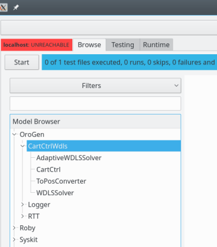
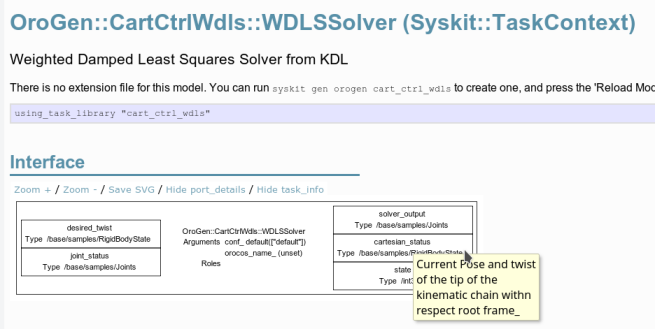

# Compositions: designing the network for the cartesian control of an arm
{:.no_toc}

**Where are we ?** We are now going to try and do simple control [of our simulated
arm](getting_started.html). We are going to do the integration of the control
components and UR10 arm on Gazebo from scratch. However, we are going to see
later than Syskit allows to make this integration generic, so that it can be
reused.

Below, the parts we will handle on this page are in blue and the things that will be handled later in grey

{: .fullwidth}

- TOC
{:toc}

In Syskit, one has to _declare_ how components must be connected together to
form a function, and then can request the system to actually run that function.
This page deals with the first step (design). The [next
page](constant_generator.html) will create the command generator, and we will
then [_deploy_ the network](deployment.html) and run it.

But let's not get too much ahead of ourselves. We will need to first install
the control package that will implement the control.

## Installing the necessary packages {#add_package}

Packages in Rock as maintained within the overall Rock workspace. Package
related configuration is contained within the `autoproj/` folder within the
workspace's root directory (where you [originally
bootstrapped](installation.html)). When working in a terminal, you can go
at any time to the workspace's root directory by running `acd` without
arguments (there's more about `acd` in this section's [Day to Day Commands](day_to_day.html#acd)).

Within the `autoproj/` directory, packages are defined within _package sets_.
These package sets define both how to build the package and where it should be
downloaded from. The default installation imports at least the `rock.core` and
the `rock` package sets (see the `package_sets` section in
`autoproj/manifest`). The `rock` package set is where the control packages we
will be using are defined.

<a class="btn btn-warning" role="button" data-toggle="collapse" href="#autoproj_show" aria-expanded="false" aria-controls="autoproj_show">
  Advanced
</a>Finding more about a package using `autoproj show`

Use `autoproj show` to find more about a given package. For `cart_ctrl_wdls`, this gives:

~~~
$ autoproj show cart_ctrl_wdls
source package control/orogen/cart_ctrl_wdls
this package is not checked out yet, the dependency information will probably be incomplete
source definition
  WARN: control/orogen/cart_ctrl_wdls from rock does not have a manifest
	type: git
	url: https://github.com/rock-control/control-orogen-cart_ctrl_wdls.git
	branch: master
	interactive: false
	push_to: git@github.com:/rock-control/control-orogen-cart_ctrl_wdls.git
	repository_id: github:/rock-control/control-orogen-cart_ctrl_wdls.git
	retry_count: 10
	first match: in rock (/home/doudou/dev/vanilla/rock-website/autoproj/remotes/rock/source.yml)
		branch: $ROCK_BRANCH
		github: rock-control/control-$PACKAGE_BASENAME
	overriden in rock (/home/doudou/dev/vanilla/rock-website/autoproj/remotes/rock/source.yml)
		branch: $ROCK_BRANCH
		github: rock-control/control-orogen-$PACKAGE_BASENAME
	is not directly selected by the manifest
~~~

The "first match" line is always the package set where the package is defined. In this case, the
`rock` package set, which is checked out in `autoproj/remotes/rock/`

In this tutorial, we will want to use the `control/orogen/cart_ctrl_wdls` which
uses the KDL library to do cartesian control of a robotic arm.  To install the
package, add it in the `layout` section of `autoproj/manifest`:

~~~yaml
layout:
- rock.core
- rock.gazebo
- control/orogen/cart_ctrl_wdls
~~~

Then, run the following to checkout missing packages but avoid updating the existing ones:

~~~
aup --checkout-only --all
~~~

And finally build and install

~~~
amake --all
~~~

## Using the installed components

Now that everything's installed, go back within the bundle folder. You may not
use `acd` for this ([more about `acd`](day_to_day.html#acd)) yet, since the
bundle has not been registered in autoproj.

Compositions declare groups of components and connects them together. Once
defined, compositions can be used in other compositions to build more complex
networks.

Let's create our first building block, the `ArmCartesianControlWdls` composition

~~~
$ syskit gen cmp arm_cartesian_control_wdls
      create  models/compositions
      create  models/compositions/arm_cartesian_control_wdls.rb
      create  test/compositions
      create  test/compositions/test_arm_cartesian_control_wdls.rb
~~~

As described in our [brief introduction](index.html), oroGen packages are where
the functionality implemented in the library packages are "packaged" into
things that can be used at runtime. To be used in Syskit, these oroGen
components must be first imported using the `using_task_library` statement. In
our case, `cart_ctrl_wdls`, this is done with

~~~ruby
using_task_library "cart_ctrl_wdls"
~~~

This loads the oroGen project, and imports the components in it to make them
available in the Syskit models. The task models from the oroGen project are
then made available within the Syskit app under the
`OroGen.project_name.ComponentName` scheme, e.g. the
`cart_ctrl_wdls::ToPosConverter` component is accessible under
`OroGen.cart_ctrl_wdls.ToPosConverter` in Syskit.

In case you're not sure about the naming, just add the `using_task_library`
statement at the toplevel of a file and load it with `syskit ide`.

Let's do so in our newly created
`models/compositions/arm_cartesian_control_wdls.rb`. Then, run

~~~
syskit ide -rgazebo models/compositions/arm_cartesian_control_wdls.rb
~~~

{: .fullwidth}

**Note** Leave the IDE open, we will reuse it
{: .note}

We now want to build the cartesian control network. What each component does in
the `cart_ctrl_wdls` project can be found by reading the documentation displayed
in the IDE (at the top of each component's page), and the documentation of the ports (displayed as tooltips).

{: .fullwidth}

We will want to run the
control components, and the simulated arm. The latter is represented by a
`CommonModels::Devices::Gazebo::Model` (we will see what `Devices` are about at a
later point). So edit the newly-created
`models/compositions/arm_cartesian_control_wdls.rb` and `add` the components

~~~ruby
require 'common_models/models/devices/gazebo/model'
# Load the oroGen project
using_task_library 'cart_ctrl_wdls'

module SyskitBasics
    module Compositions
        class ArmCartesianControlWdls < Syskit::Composition
            add OroGen.cart_ctrl_wdls.WDLSSolver, as: 'twist2joint_velocity'
            add OroGen.cart_ctrl_wdls.CartCtrl, as: 'position2twist'
            add CommonModels::Devices::Gazebo::Model, as: 'arm'
        end
    end
end
~~~

At this stage, we will have to connect the ports together. To see what inputs
and outputs are available, one can have a look at the component's `.orogen`
files. The alternative is to use the IDE. Click the `Reload Models` button and
open the composition page:

<iframe width="853" height="480" src="https://www.youtube.com/embed/9Sz7gREngHM?rel=0&amp;showinfo=0" frameborder="0" allowfullscreen></iframe>

We may now start adding connections in the composition definition. The `as`
arguments when adding composition elements create an accessor for the children.
The children ports are then accessible with a `_port` accessor. For instance,
the `ctrl_out` port of the `CartCtrl` component is accessed with
`position2twist_child.ctrl_out_port`.

Let's connect that one to the `WDLSSolver` twist input, and the WDLSSolver
command to the actual arm command input:

~~~ruby
class ArmCartesianControlWdls < Syskit::Composition
    add OroGen.cart_ctrl_wdls.WDLSSolver, as: 'twist2joint_velocity'
    add OroGen.cart_ctrl_wdls.CartCtrl, as: 'position2twist'
    add CommonModels::Devices::Gazebo::Model, as: 'arm'

    position2twist_child.ctrl_out_port.
        connect_to twist2joint_velocity_child.desired_twist_port
    twist2joint_velocity_child.solver_output_port.
        connect_to arm_child.joints_cmd_port
end
~~~

And hit the "Reload Models" button at the top of the IDE window. Syntax errors
(such as a misspelled port name) are shows at the bottom of the view. Just
click reload after you fixed them.

Let's inspect the remaining unconnected input ports. There's `command`,
`cartesian_status` and `joint_status` ports that obviously need to be connected
to something. `joint_status` is the direct joint feedback from the arm:

~~~ruby
arm_child.joints_status_port.
    connect_to twist2joint_velocity_child.joint_status_port
~~~

However, the cartesian position feedback is not directly provided by the Gazebo
model. Fortunately, the `control/orogen/robot_frames` project provides components
to do the joint-to-cartesian conversion. Add it now to the workspace [in the same way we added
`control/orogen/cart_ctrl_wdls`](#add_package), import it in the composition
file with `using_task_library` and reload models within the IDE.
Then, finally add it to the composition.

~~~ruby
# This is in bundles/common_models
require 'common_models/models/devices/gazebo/model'
# Load the oroGen projects
using_task_library 'cart_ctrl_wdls'
using_task_library 'robot_frames'

module SyskitBasics
    module Compositions
        class ArmCartesianControlWdls < Syskit::Composition
            add OroGen.cart_ctrl_wdls.WDLSSolver, as: 'twist2joint_velocity'
            add OroGen.cart_ctrl_wdls.CartCtrl, as: 'position2twist'
            add CommonModels::Devices::Gazebo::Model, as: 'arm'
            add OroGen.robot_frames.SingleChainPublisher, as: 'joint2pose'

            position2twist_child.ctrl_out_port.
                connect_to twist2joint_velocity_child.desired_twist_port
            twist2joint_velocity_child.solver_output_port.
                connect_to arm_child.joints_cmd_port
            arm_child.joints_status_port.
                connect_to twist2joint_velocity_child.joint_status_port
            arm_child.joints_status_port.
                connect_to joint2pose_child.joints_samples_port
            joint2pose_child.tip_pose_port.
                connect_to position2twist_child.cartesian_status_port
        end
    end
end
~~~

This leaves us with the command port.

The role of this composition is to provide us with a cartesian control of an
arm. It currently does that. Leaving the command out of the composition allows
us to reuse it with different command producers.

We will now turn this composition into a "component" with a single command input
by **exporting** the command port on the composition interface. This is done
with the `export` keyword, in the composition class context:

~~~ruby
export position2twist_child.command_port
~~~

In the IDE, this is represented as a port on the composition, and a connection
between this port and the exported port. These are the only connections that can
bind two input ports or two input ports together.

{: .fullwidth}

**Next**: before we can actually run the whole thing, [we must create a command generator for it](constant_generator.html)
{: .next-page}
