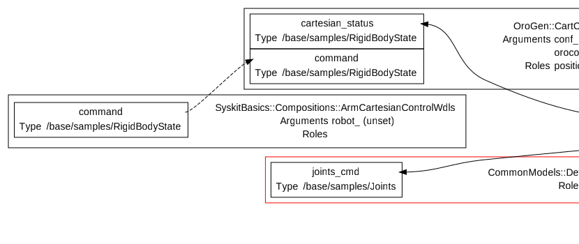

# Creating our Command Generator
{:.no_toc}

- TOC
{:toc}

[The control network we just created](composition.html) does not have a command
generator. The first generator one usually creates is a constant one, creating an
interface to send a constant command from Syskit into a control network.

We will create the command generator now, then bind the result [to the simulation](devices.html)
and finally [deploy and run it](deployment.html).

We will also learn how to write unit tests.

## The Cartesian Constant Generator

For the command, let's generate a single constant command. It will allow us to
move the arm tip from one point to another, expressed in the cartesian frame.

The first thing is to find out what's the data type of the port. If we look at
the dataflow in the `ArmCartesianControlWdls` composition, we find:

{: .fullwidth}

The type name is `/base/samples/RigidBodyState`. Types like this one are
defined when implementing components, which is something we will see
[later](../writing_components/types.html). You can have an overview of the
types already available in your Rock workspace by starting the
`rock-browse` tool.

`bundles/common_models` provides `Compositions::ConstantGenerator`, a generic
implementation of a component that periodically emits a value of a certain type. This generator is
a `Syskit::RubyTaskContext`, which is like an oroGen component that is part of
the Syskit process. It's useful to create very simple components without having
to get through the whole oroGen step. It is also used in tests to stub existing components.

`ConstantGenerator` is generic, so it's not used as-is. One instead
creates a specific component for the task at hand. In our case, we'll create
the `Compositions::ArmCartesianConstantCommandGenerator` generator specialized for
our purposes.

First, generate the new model

~~~
$ syskit gen ruby_task arm_cartesian_constant_command_generator
      exists  models/compositions
      create  models/compositions/arm_cartesian_constant_command_generator.rb
      exists  test/compositions
      create  test/compositions/test_arm_cartesian_constant_command_generator.rb
~~~

The easiest way to reuse the constant generator is to subclass our generator
from it, by using the `ConstantGenerator.for(type)` method:

~~~ruby
import_types_from 'base'
require 'models/compositions/constant_generator'

module SyskitBasics
  module Compositions
    class ArmCartesianConstantCommandGenerator < CommonModels::Compositions::ConstantGenerator.
      for('/base/samples/RigidBodyState')
    end
  end
end
~~~

which gives us

{: .fullwidth}

The documentation of the `out` port tells us that its value is controlled by
the 'values' arguments. Task arguments are ways to parametrize tasks from
within Syskit, and are listed in the middle of the task rectangle. In the
generator, we see for instance four: `period`, `orocos_name`, `conf` and
`values`. `orocos_name` is set by Syskit itself, `period` is the period at
which the value should be generated. We will see about `conf` later on this
page.

## Improving the arguments

The format of the 'values' is actually awkward for a command generator. Let's
provide a better `setpoint` argument that is transformed to set `values`.

~~~ruby
class ArmCartesianConstantCommandGenerator < ...
  # The setpoint as a { position: p, orientation: q } hash
  argument :setpoint

  def setpoint=(setpoint)
    rbs = Types.base.samples.RigidBodyState.Invalid
    # Use 'fetch' to generate an error if the key is not present
    # in the hash
    rbs.position = setpoint.fetch(:position)
    rbs.orientation = setpoint.fetch(:orientation)
    self.values = Hash['out' => rbs]
  end
end
~~~

**Note**: the position and orientation here are assumed to be respectively a
vector (of type Eigen::Vector3) and a quaternion (of type Eigen::Quaternion).
The underlying type system [is a subject for another
part](../writing_components/types.html). For now, just accept it.
{: .callout .callout-info}

This kind of "high-level argument shadowing low-level
arguments must have a one-to-N relationship (usually one-to-one). It is
possible but not trivial, under the Syskit argument handling, to "aggregate"
multiple high-level arguments into a low-level one.
{: .callout .callout-warning}

Finally, the command is timestamped, so we need to update the timestamp
each time the value is read

~~~ruby
class ArmCartesianConstantCommandGenerator < ...
  def values
    if v = super
      # Do not change the argument "under the hood"
      sample = v['out'].dup
      sample.time = Time.now
      Hash['out' => sample]
    end
  end
end
~~~

## Testing

Unlike the composition that created the arm control network, the
`ArmCartesianConstantCommandGenerator` contains "active" code, that is code that will
be evaluated at runtime. It is important to properly unit-test it to ensure
its correctness.

Each time we ran `syskit gen`, files were created both in `models/` and
`test/`. The default Syskit test framework is the spec implementation of
[minitest](https://github.com/seattlerb/minitest). Let's now adapt these
templates for our generator.

Start by deleting the default test from `test/compositions/test_arm_cartesian_constant_command_generator.rb`.

The first step in each test usually is to get a deployed, ready-to-test instance
of our component or composition model. The test harness provides a set of methods
for this:

- `syskit_stub_and_deploy` will create this instance
- `syskit_configure` will then configure it, making it ready to be started
- `syskit_start` will then start it

Commonly, one would use `syskit_stub_deploy_and_configure` and
`syskit_stub_deploy_configure_and_start` as shortcuts for the sequential calls.

The argument to these methods is the task model under test, that is
`ArmCartesianConstantCommandGenerator` here. If arguments are needed, they are
provided with the `.with_arguments(key: 'value')` call. Testing how `values` is
set from `setpoint` therefore looks like:

~~~ruby
it "propagates its position and orientation arguments to #values" do
  p = Eigen::Vector3.new(1, 2, 3)
  q = Eigen::Quaternion.from_angle_axis(0.2, Eigen::Vector3.UnitX)
  task = syskit_stub_deploy_configure_and_start(
    ArmCartesianConstantCommandGenerator.
      with_arguments(setpoint: Hash[position: p, orientation: q]))
  assert_equal p, task.values['out'].position
  assert_equal q, task.values['out'].orientation
end
~~~

From the command line, one runs the tests on a single file with:
{: id="run_test_command_line"}

~~~
$ syskit test -rgazebo test/compositions/test_arm_cartesian_constant_command_generator.rb
~~~

and all the tests for a given robot configuration with

~~~
$ syskit test -rgazebo
~~~

The IDE also gives an interface to the tests. It will display all the tests for
the given robot configuration and allow to start them separately.  It also
allows to auto-run all the discovered tests, and re-run tests when the files
change, like so:
{: id="run_test_ide"}

<iframe width="853" height="480" src="https://www.youtube.com/embed/Z-asD-4yM8w?rel=0&amp;showinfo=0" frameborder="0" allowfullscreen></iframe>

Now, let's test if the timestamp is properly set. Given that time is a very common
quantity in Syskit tests, the Syskit test harness integrates with the
[timecop](https://github.com/travisjeffery/timecop) library.

~~~ruby
it "returns the value with an updated timestamp" do
  p = Eigen::Vector3.new(1, 2, 3)
  q = Eigen::Quaternion.from_angle_axis(0.2, Eigen::Vector3.UnitX)
  task = syskit_stub_deploy_configure_and_start(
    ArmCartesianConstantCommandGenerator.
      with_arguments(setpoint: Hash[position: p, orientation: q]))
  Timecop.freeze(expected_time = Time.now)
  sample = expect_execution.to do
    have_one_new_sample task.out_port
  end
  assert_in_delta expected_time, sample.time, 1e-6
end
~~~

The `expect_execution` construct is the Syskit starting point for all things
asynchronous in tests. Sending and receiving samples requires the constant
generator to be executed, and therefore Syskit's own execution loop.
{: .callout .callout-info}

Rock's time representation has a precision of one microseconds, while Linux
(and therefore Ruby's Time class) go to the nanoseconds. This is why the
time comparison is not done using `assert_equal`, but `assert_in_delta`.
{: .callout .callout-warning}

Given that the preamble of our two tests is the same, it would be best to move it into a `before` block:

~~~ruby
describe ArmCartesianConstantCommandGenerator do
  attr_reader :task, :p, :q
  before do
    @p = Eigen::Vector3.new(1, 2, 3)
    @q = Eigen::Quaternion.from_angle_axis(0.2, Eigen::Vector3.UnitX)
    @task = syskit_stub_deploy_configure_and_start(
      ArmCartesianConstantCommandGenerator.
        with_arguments(setpoint: Hash[position: p, orientation: q]))
  end

  it "propagates its position and orientation arguments to #values" do
    assert_equal p, task.values['out'].position
    assert_equal q, task.values['out'].orientation
  end

  it "returns the value with an updated timestamp" do
    Timecop.freeze(expected_time = Time.now)
    sample = expect_execution.to do
      have_one_new_sample task.out_port
    end
    assert_in_delta expected_time, sample.time, 1e-6
  end
end
~~~

## Creating the ArmCartesianConstantControlWdls Composition

Now that we have a generator, let's bind it to our control loop to have
something that can move and hold our arm to a given pose.

We'll create the composition now.

~~~
$ syskit gen cmp arm_cartesian_constant_control_wdls
~~~

Trivially, the network just binds the control network with the generator:

~~~ruby
require 'models/compositions/arm_cartesian_constant_command_generator'
require 'models/compositions/arm_cartesian_control_wdls'

module SyskitBasics
  module Compositions
    class ArmCartesianConstantControlWdls < Syskit::Composition
      add ArmCartesianConstantCommandGenerator, as: 'command'
      add ArmCartesianControlWdls, as: 'control'

      command_child.out_port.
        connect_to control_child.command_port
    end
  end
end
~~~

Inspect the resulting network in the IDE. See how the hierarchy view has two
levels of composition, which is resolved at the dataflow level.

**Tip**: One can hide the compositions in the dataflow view to help readability with the `Hide compositions` button
{: .callout .callout-info}

Let's run the generated test now:
{: id="missing_arguments"}

~~~
$ syskit test -rgazebo test/compositions/test_arm_cartesian_constant_control_wdls.rb
Run options: --seed 31835

# Running:

E

Finished in 0.341306s, 2.9299 runs/s, 5.8598 assertions/s.

  1) Error:
SyskitBasics::Compositions::ArmCartesianConstantControlWdls#test_0001_starts:

cannot find an ordering to configure 1 tasks
SyskitBasics::Compositions::ArmCartesianConstantCommandGenerator:0x2714010
  owners: 
  arguments: 
    orocos_name: "stub3",
    period: 0.1,
    conf: ["default"]
  ready_for_setup? false
  missing_arguments: setpoint, values
  has no should_configure_after constraint
    …manipulation.rb:788:in `syskit_configure'
    …manipulation.rb:1047:in `syskit_configure_and_start'
    …manipulation.rb:1006:in `syskit_stub_deploy_configure_and_start'
    test/compositions/test_arm_cartesian_constant_control_wdls.rb:10:in `block (2 levels) in <module:Compositions>'
~~~

As-is, the test generated by the template fails. The test looks like:

~~~ruby
cmp_task = syskit_stub_deploy_configure_and_start(
  ArmCartesianConstantControlWdls)
~~~

The error message is that `cannot find an ordering to configure 1 tasks`, the
task being
`SyskitBasics::Compositions::ArmCartesianConstantCommandGenerator:0x2714010`.
This is not our composition, but the constant generator. What's going on ?

Syskit tasks can only be configured and started if all their arguments are set.
Having unset arguments is a very common cause for the error we're having here,
and indeed we can see that `missing_arguments: setpoint, values`.

In order to be able to see the encompassing `ArmCartesianConstantControlWdls`
as a single component for the outside system, we would need to define a
setpoint argument on it and forward it to the generator. This is a very common
pattern, and Syskit supports it:
{: id="composition_forward_argument"}

~~~ruby
require 'models/compositions/arm_cartesian_constant_command_generator'
require 'models/compositions/arm_cartesian_control_wdls'

module SyskitBasics
  module Compositions
    class ArmCartesianConstantControlWdls < Syskit::Composition
      argument :setpoint

      add(ArmCartesianConstantCommandGenerator, as: 'command').
        with_arguments(setpoint: from(:parent_task).setpoint)
      ...
    end
  end
end
~~~

Let's modify the test to actually set the setpoint, and verify it is forwarded.
Delete the `it "starts"` test and replace it with

~~~ruby
it "forwards its setpoint argument to the generator child" do
  setpoint = Hash[
    position: Eigen::Vector3.new(1, 2, 3),
    orientation: Eigen::Quaternion.from_angle_axis(0.4, Eigen::Vector3.UnitZ)]
  cmp = syskit_stub_deploy_configure_and_start(
    ArmCartesianConstantControlWdls.with_arguments(setpoint: setpoint))
  assert_equal setpoint, cmp.command_child.setpoint
end
~~~

## The Joint Position Constant Generator {#joint_position_constant_generator}

There's another control mode that we need. In order to either hold a position,
or go into a safe position, one needs a joint position constant generator and
the corresponding composition.

The creation of this generator is left to the reader. 

**Tip**: a good representation for the setpoint would be a
`joint_name=>joint_position` hash, where `joint_name` is a string and
`joint_position` a floating-point value (always in radians !). Given that we've
not yet dealt with the type system, you will also need to know that to create
a `/base/commands/Joints` from within Ruby, you do:

~~~
Types.base.commands.Joints.new(
  time: Time.at(0),
  names: joint_names,
  elements: joint_commands)
~~~

where `joint_names` is an array of strings and `joint_commands` an array of

~~~
Types.base.JointState.new(
  position: position,
  speed: Float::NAN
  effort: Float::NAN
  raw: Float::NAN
  acceleration: Float::NAN)
~~~

`NaN` is used within Rock to indicate either 'unset' (for commands) or
'unknown' (for sensor readings)

<a class="btn btn-info" role="button" data-toggle="collapse" href="#under_the_hood" aria-expanded="false" aria-controls="under_the_hood">
  Solution
</a>The JointPositionConstantGenerator

Let's generate the files

~~~
syskit gen ruby_task joint_position_constant_generator
~~~

`models/compositions/joint_position_constant_generator.rb`:

~~~ruby
require 'models/compositions/constant_generator'
import_types_from 'base'
require 'base/float'

module SyskitBasics
  module Compositions
    class JointPositionConstantGenerator <
      CommonModels::Compositions::ConstantGenerator.
        for('/base/commands/Joints')

      # The setpoint as a hash of joint names to joint positions
      argument :setpoint

      def setpoint=(setpoint)
        joint_names    = setpoint.keys
        joint_commands = setpoint.each_value.map do |position|
          Types.base.JointState.new(
            position: position,
            speed: Base.unset,
            effort: Base.unset,
            raw: Base.unset,
            acceleration: Base.unset)
        end
        self.values = Hash['out' =>
          Types.base.commands.Joints.new(
            time: Time.at(0),
            names: joint_names,
            elements: joint_commands)]
      end

      def values
        if v = super
          # Do not change the argument "under the hood"
          sample = v['out'].dup
          sample.time = Time.now
          Hash['out' => sample]
        end
      end
    end
  end
end
~~~

and the test `test/compositions/test_joint_position_constant_generator.rb`:

~~~ruby
require 'models/compositions/joint_position_constant_generator'

module SyskitBasics
  module Compositions
    describe JointPositionConstantGenerator do
      it "sets the names and positions based on the given hash" do
        task = syskit_stub_deploy_configure_and_start(
          JointPositionConstantGenerator.
            with_arguments(setpoint: Hash['j0' => 10, 'j1' => 20]))
        assert_equal ['j0', 'j1'], task.values['out'].names
        assert_equal [10, 20], task.values['out'].elements.map(&:position)
      end

      it "returns the value with an updated timestamp" do
        task = syskit_stub_deploy_configure_and_start(
          JointPositionConstantGenerator.
            with_arguments(setpoint: Hash['j0' => 10, 'j1' => 20]))
        Timecop.freeze(expected_time = Time.now)
        sample = expect_execution.to do
          have_one_new_sample task.out_port
        end
        assert_in_delta expected_time, sample.time, 1e-6
      end
    end
  end
end
~~~

Let's now create the corresponding composition:

~~~
syskit gen cmp joint_position_constant_control
~~~

Fill the implementation in `models/compositions/joint_position_constant_control.rb`:

~~~ruby
require 'models/devices/gazebo/model'
require 'models/compositions/joint_position_constant_generator'

module SyskitBasics
  module Compositions
    class JointPositionConstantControl < Syskit::Composition
      # The setpoint as a 'joint_name' => position_in_radians hash
      argument :setpoint

      add CommonModels::Devices::Gazebo::Model, as: 'arm'
      add(JointPositionConstantGenerator, as: 'command').
        with_arguments(setpoint: from(:parent_task).setpoint)

      command_child.out_port.connect_to \
        arm_child.joints_cmd_port
    end
  end
end
~~~

And modify the test:

~~~ruby
require 'models/compositions/joint_position_constant_control'

module SyskitBasics
  module Compositions
    describe JointPositionConstantControl do
      it "forwards its setpoint argument to the constant generator" do
        cmp_task = syskit_stub_deploy_configure_and_start(
            JointPositionConstantControl.with_arguments(setpoint: Hash['j0' => 10]))
        assert_equal Hash['j0' => 10], cmp_task.command_child.setpoint
      end
    end
  end
end
~~~

**Next**: We can now map the composition's `arm` child to the arm within the
simulation.  Let's do [a detour to device models](devices.html) to then finally
[run our network](deployment.html)
{: .next-page}
