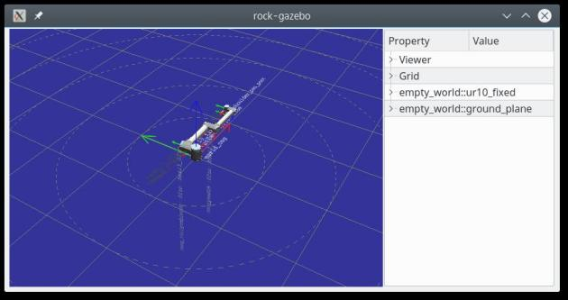

# Getting Started
{:.no_toc}

- TOC
{:toc}

We'll be getting right into the meat of things by creating a system's
integration package (a `bundle`), and setup a gazebo environment that will
allow us to continue with actually doing something with the system.

## Bundles and bundles' file structure

In Rock, the central place where the system design and integration happens is a
_bundle_. A bundle package is created in the `bundles/` folder of your Rock
workspace. For the time being, you can see bundles as a collection of
Syskit models (in `models/`), configuration files (in `config/`), SDF scenes
(`scenes/`) and SDF models (`models/sdf/`).

The following assumes that you have a [bootstrapped Rock
installation](installation.html), and that you have a terminal in which this
installation's `env.sh` file has been sourced.

Let's create a new bundle. In your Rock's workspace do

~~~
acd
cd bundles
syskit gen app syskit_basics
cd syskit_basics
~~~

This creates a Roby application, Roby being the underlying application framework
and execution engine that Syskit is based on. In addition, it loads and sets up
Syskit in the applications `config/init.rb`.

We can now verify that the generated application loads with

~~~
$ syskit run
Bundles[INFO]: Active bundles: syskit_basics
default[INFO]: logs are in /home/doudou/dev/logs_area/syskit_basics/20170609-1609
default[INFO]: loaded Roby on ruby 2.3.1p112 (2016-04-26 revision 54768) [x86_64-linux]
default[INFO]: done initialization
default[INFO]: ready
~~~

Either hit CTRL+C, or run `syskit quit` in another terminal, to make it exit.

~~~
$ syskit quit
Bundles[INFO]: Active bundles: syskit_basics
default[INFO]: connected
default[INFO]: waiting for remote app to terminate
default[INFO]: closed communication
~~~

## Robot and Scene description using SDF

The [Scene Description Format](http://sdformat.org) is a XML format defined by the
Gazebo developers to describe both scenes and objects in these scenes (as e.g.
robots). We're going to learn how to leverage the information present in an SDF
file as possible, with the goal of having the SDF be the authoritative
information source for any information that can be represented in it.

But for now, let's get to create ourselves a scene with a robot in it. We
will **not** describe the SDF format in details, there's a lot of
Gazebo-related documentation about that, [including a reference of the format
on sdformat.org](http://sdformat.org/spec)

SDF scenes are made of _models_. Loosely-speaking, each model represents one
object in the scene. Moreover, models can be included in scenes through the
`<include>` tags, allowing to reuse models in different scenes. In general,
your robot should at least be described in a separate model to allow you to
reuse it in different simulation scenes.

For the purpose of this part of the documentation, we'll use Gazebo's UR10 arm
model as our robot. We however need to integrate it in another model so that
its base is fixed (using [this
method](http://answers.gazebosim.org/question/5065/how-to-attach-arm-to-a-static-base-using-sdf/)).

Usually, the first scene one creates is an empty one, which later will give us
an environment in which to test basic functionality, without having to care
about collisions.

In the bundles, scenes are saved in `scenes/SCENE_NAME/SCENE_NAME.world`, e.g.
`scenes/empty_world/empty_world.world`:

~~~xml
<?xml version="1.0"?>
<sdf version="1.6">
  <world name="empty_world">
    <model name="ur10_fixed">
        <include>
          <name>ur10</name>
          <uri>model://ur10</uri>
        </include>
        <joint name="attached_to_ground" type="fixed">
          <parent>world</parent>
          <child>ur10::base</child>
        </joint>
    </model>
    <include>
      <uri>model://ground_plane</uri>
    </include>
  </world>
</sdf>
~~~

## Running and visualizing a Gazebo environment

Rock offers `vizkit3d`, its own 3D visualization environment. Since we will
definitely want to augment the visualization of the world with e.g. algorithm
feedback and/or sensor data, we'll be using this environment for the Gazebo
world as well, instead of using Gazebo's client.

The `rock-gazebo` tool starts a Vizkit3D visualization for the Gazebo scene.

~~~
rock-gazebo empty_world
~~~

Starts both a Gazebo simulation and displays it:

{: .fullwidth}

The `ur10` and `ground_plane` models we are referencing in this world file need
to be downloaded from Gazebo's model repository. This is done automatically by
`rock-gazebo` the first time they're needed, but can also be done explicitly with
the `--download-only` option, e.g.

~~~
rock-gazebo --download-only empty_world
~~~

## Preparing the `gazebo` Syskit configuration {#syskit_gazebo_configuration}

Syskit configuration in bundles may be split into multiple configurations /
environments called "robots". A common organization is to create one bundle
per robot type or project, and create two robot configuration in it, one for
the simulation (`gazebo`) and one for the live system (`live`).

Let's create the `gazebo` configuration:

~~~
$ syskit gen robot gazebo
Bundles[INFO]: Active bundles: syskit_basics
      exists  config/robots
      create  config/robots/gazebo.rb
~~~

In order to setup Syskit to use the Gazebo instance, we first have to require
integration code and then load the environment. This is done by modifying the
newly-created `config/robots/gazebo.rb` configuration file to add:
{: #initial_setup}

~~~ruby
Robot.init do
  # The rock-gazebo bridge requires models from the 'common_models' bundle.
  # It already depends on it, but we need to manually add the bundle to the
  # Roby search path
  Roby.app.search_path << File.expand_path('../../../common_models', __dir__)
  require 'rock_gazebo/syskit'
  Conf.syskit.transformer_enabled = true
end

Robot.requires do
  Syskit.conf.use_gazebo_world('empty_world')
end
~~~

**Next**: now that we have a minimal scene and a working Gazebo installation, [let's do
something with it](composition.html)
{: .next-page}

<a class="btn btn-warning" role="button" data-toggle="collapse" href="#under_the_hood" aria-expanded="false" aria-controls="under_the_hood">
  Advanced
</a>Under the hood: how does the Rock/Gazebo bridge work

Under the hood, the objects in the Gazebo instance are exposed to the Rock
system by means of [a Gazebo system
plugin](http://gazebosim.org/tutorials?tut=system_plugin). Each model, link,
sensor and some plugins are exposed this way. The plugin is implemented in the
[`simulation/rock_gazebo` package](https://github.com/rock-gazebo/simulation-rock_gazebo). The components
that implement this interface are implemented in the
[`simulation/orogen/rock_gazebo` package](https://github.com/rock-gazebo/simulation-orogen-rock_gazebo),
and are being run within the Gazebo process itself, synchronously with the
Gazebo simulation loop. The `rock-gazebo` and `rock-gzserver` tools are simple
shell wrappers around the `gazebo` and `gzserver` commands, but with the
addition of the system plugin.

The task contexts in our scene can be visualized with rock-display:

{: .fullwidth}

`rock-gazebo-viz` sets up the visualization to match the data in the SDF file and
then listen to pose updates from the `rock_gazebo::ModelTask` components exposed by the
Gazebo process. Given that this data is only output if the components are running,
`rock-gazebo-viz` starts them automatically. Use `--no-start` to avoid this.

