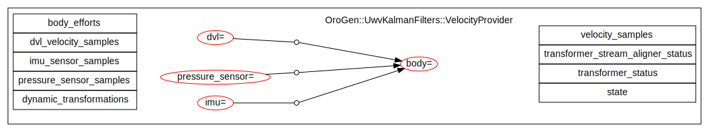
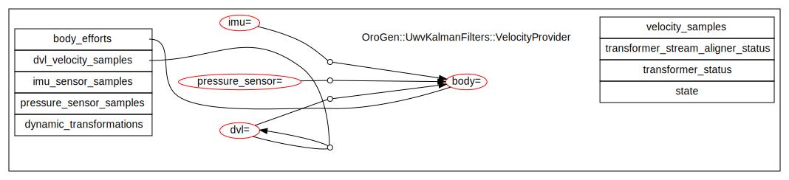
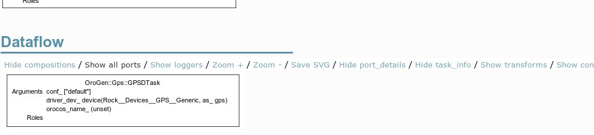

# Geometric Relations

One of the most common tasks in a robotic systems is to represent the
relationship between a robot body (or one of its parts) and the world. E.g. a
gripper and an object being gripped, an AUV and the ground (to avoid bumping
into it), ... These relations are usually estimated through complex processing
chains. The object-gripper relation is built by sensing the object in one or
multiple sensors (LIDAR, camera, ...) which are attached on the robot. Each of
these sensors provide information about the pose of the object _in the sensor
frame_. A.k.a. the sensor-object transform.

However, the task (in our example, gripping the object), requires the
object-gripper transform. For instance, the pose of the object in the gripper
frame. Obtaining it requires static data (the shape of the robot's kinematic
chains) and dynamic data (the joint positions that would allow to resolve the
kinematic chains).

From the point of view of the component design, it is important to consider
these aspects both on the input side and on the output side. The former is
asking the question: do I need to do transformations between the frames of my
inputs, and if yes, which extra transforms do I need ? The latter asks the
question: what will my output be used for, in which frame should it be expressed
?

From a system design point of view, one can quickly realize that the choice of
frames and how the components are connected are related. The role of Syskit
there is to keep the ability to combine networks and of changing the network
shapes with minimal work, while ensuring a network-wide consistency w.r.t. the
choice of frames.

To keep components generic, a component's code only have to deal with _logical
frames_, i.e. it defines a set of frames that are relevant for the computation
it does. These frames are mapped at runtime by Syskit to system-wide names that
represent the frames on the robot and/or in its environment.

  

    <h4>Setup</h4>
  

Geometry support requires that you have `drivers/orogen/transformer`
in your workspace. Moreover, your Syskit bundle must have

~~~ruby
Robot.init do
  Syskit.conf.transformer_enabled = true
end
~~~

in the robot configuration file (either `config/robots/default.rb`
or a robot-specific configuration)

## Geometry in components

Rock's `base::samples::RigidBodyState` (RBS) type represents the state (pose and
velocity) of a rigid body expressed in a certain reference frame. The body's
own frame is the RBS `sourceFrame` field. The reference frame is the RBS
`targetFrame`. Because the RBS must embed frame names, the
component-level/system-level frame abstraction described above leaks when a
component outputs a RBS. In effect, the component _must know_ the global frame
names as it is responsible for filling its
`sourceFrame` and `targetFrame` field.
{:#rbs}
{:.alert .alert-info}

We'll now present the role of frames and transforms in data source components,
i.e. components that generate new data samples, and data processing components,
that is components that transform data samples using frames and frame
transforms.

### In data sources {#data_sources}

Data sources (e.g. devices) usually do not deal directly with transformations.
However, certain data sources, such as for instance a GPS or an IMU, produce
an estimate of transformations themselves. In Rock, the data type that
represents these transformations (`base::samples::RigidBodyState`) embeds the
name of the transformation's source and target frame and the component must
therefore allow to set these frames.

The convention - on which the Syskit system setup relies - is to name these
properties `${framename}_frame`. For instance, for a GPS's UTM output one could
pick:

~~~ ruby
# The frame of the world, e.g. the UTM origin
property 'utm_frame', '/std/string'
# The frame of the gps device
property 'gps_frame', '/std/string'
~~~

which would then be written before writing the sample on the output (see [the
note about RigidBodyState](#rbs))

~~~ c++
gps_pose.sourceFrame = _gps_frame.get();
gps_pose.targetFrame = _utm_frame.get();
~~~

### In data processing components

A common role of frames and transforms in data processing components is to
allow to represent multiple inputs within the same reference frame. Indeed,
while the inputs may be expressed in different frames, to combine them one
needs to transform them into a common frame. In Rock, the transformer oroGen
plugin helps with this process. To use it one, needs first to depend on the
`drivers/orogen/transfomer` package by adding the following line to the
package's `manifest.xml`.

~~~ xml
<depend package="drivers/orogen/transformer" />
~~~

Then, one needs to wonder which transformations are required by the processing.
Frame names that are appropriate _within the component's context_ must be
chosen, and declared in the oroGen's transformer block. Since a transformer is
also a stream aligner, the block must also contain a `max_latency` declaration.

~~~ ruby
task_context "Task" do
    needs_configuration
    ...
    transformer do
        transform 'from', 'to'
        max_latency 0.1
    end
end
~~~

For instance, a visual servoing component that takes visual features as input
and provides a command within the vehicle's body frame would have the need for
the `features` to `command` transform. A common - but unfortunate - choice
would be to use `body` for the command reference frame, which (wrongly) assumes
that the command reference will always be the body frame. It would be declared
with

~~~ ruby
task_context "Task" do
    needs_configuration
    ...
    transformer do
        transform 'features', 'command'
        max_latency 0.1
    end
end
~~~

As already noted, the transformer is a stream aligner. It's common to process
the component's input streams aligned with the transformations, which is done by
adding the input streams to the transformer:

~~~ ruby
transformer do
  align_port "detected_features", 0.1
  tranform "features", "command"
  max_latency 0.1
end
~~~

Just as with the stream aligner, this generates callbacks for the declared input
streams.  Within these callbacks, the transformation objects can be queried. The
query time should be the stream aligner time (the first argument to the
callback).

~~~ cpp
void Task::detected_featuresTransformerCallback(const base::Time &ts, const ::VisualFeatures& features) {
  base::samples::RigidBodyState features2command;
  if (!_features2command.get(ts, features2command, true))
  {
      // no transform available yet, do nothing
      return;
  }

  // Do the processing
}
~~~

Within the C++, the transform object is available through a generated
`_features2command` object which can be queried through its `.get` method.

~~~ cpp
base::samples::RigidBodyState rbs;
if (!_features2command.get(time, rbs, true))
    // transform not available
else
    // transform available
~~~

The first argument to `.get` controls what is the expected time of the queried
transform. It is needed only if the transformer is expected to generate an
_interpolated transform_ by setting the third argument to `true`. 

When the third argument is `false`, the transformer computes the kinematic
chain using the transforms whose timestamp is just before the given `time`. If
it is `true`, it interpolates the transformation from the transforms it
received with a timestamp just before the passed timestamp, with the transforms
it received with a timestamp just after.

Note that this functionality will only work reliably inside the transformer
callbacks, since it ensures that the given time is ordered in time.  The
transformer does not keep a full history of everything it receives, and is
therefore very likely to fail to interpolate or even return a transform if
called outside the stream alignment callbacks.

It is somewhat tempting to use the transformer to manage all transformations
within a system. **Don't**. The transformer is really meant to handle variations
in the robotic system itself (placement of sensors and actuators). For
environment-robot transformations (pose and velocity of the robot, ...), stick
to having separate input ports.
{:.alert .alert-danger}

## System-wide frame consistency

The introduction of frames and frame transformations in components also
introduce another dimension in the component configuration. All these frames
need to be assigned to global frame names. However, what frame a component
should be configured with is related to what it is connected to. There's a
relationship between the shape of the component network (port-to-port
connections) and the configuration of frames.

In the visual servoing example above, the `features` frame should be the one of
the feature data stream, which will itself be one of the camera frames (either
optical or geometrical). If the chain starts using a different camera, the
visual servoing component's `features` frame also needs to be changed.
Breaking the consistency of the frames in the system usually leads to
hard-to-find bugs.

Given that the main paradigm in Syskit is to let the developer (you) build
networks, Syskit handles this by (1) auto-configuring frames, when possible, by
propagating them through the network and (2) when frames are set explicitly,
verifying that it is done consistently.

Devices are the main "anchor" for frames. Indeed frames are constrained by where
each data stream "comes from" in the world. This is in practice defined by the
placement of the device on the robot. What we will see in the following is how
to annotate devices with frames, and how to add annotations to component models
so that Syskit can propagate the frames in the network.

### Enabling propagation: additional component annotations in transformer-enabled components {#component_annotations}

When using the transformer, one defines frames and transformations that are
relevant for the component's computation. At this level, these frames are
considered _internal_ by Syskit, i.e. Syskit cannot guess what are the relations
between the frames declared and the component ports.

Let's open a Syskit IDE and display a component's transform annotations (the
component is [the `uwv_kalman_filters::VelocityProvider`](https://github.com/rock-slam/slam-orogen-uwv_kalman_filters)
component).

In this view, the frames are oval shaped, with the component-local frame name on
the left of the equal sign, and the global frame name assigned to it on the
right. Broken lines with a dot that connect two frames together represent
transforms.

The important aspect here is that none of these frames are associated with the
component inputs and outputs. Let's change that.

First, we need to create an orogen annotation file by running `syskit gen orogen
uwv_kalman_filters`, and then edit the generated
`models/orogen/uwv_kalman_filters.rb`. Let's add a transformer block to this,
in which we'll add the required information:

~~~ruby
class OroGen::UwvKalmanFilters::VelocityProvider
    transformer do
    end
end
~~~

Two types of annotations can be given:

* annotate a port's data stream with a frame (such as e.g. the reference frame
  of visual features). This is done with `associate_ports_to_frame`
* provide the source and target frame of a `RigidBodyState` port, this is done
  with `associate_ports_to_transform`

Let's take the `VelocityProvider` ports one by one.

* `body_efforts` represents the efforts applied on the vehicle in the body
  frame. It is expressed in the body frame itself.

  ~~~ruby
  associate_ports_to_frame "body_efforts", "body"
  ~~~

  After reloading, this new relation is represented by an edge between the port
  and the frame:

  

* `dvl_velocity_samples` is a `RigidBodyState` which represents the velocity of
  the vehicle expressed in the sensor's frame. It is therefore a dvl-to-dvl
  transform:

  ~~~ruby
  associate_ports_to_transform "dvl_velocity_samples", "dvl" => "dvl"
  ~~~

  The port-to-transform relation is represented by an edge between the port and
  the white dot in the middle of the transform:

  

* `imu_sensor_samples` is represented in the sensor's frame

  ~~~ruby
  associate_ports_to_frame "imu_sensor_samples", "imu"
  ~~~

* `pressure_sensor_samples` represents the Z-only transform between the
  "surface" (an external frame) and the sensor. Since the surface is not part of
  the component's configuration, we can add a new frame to represent it.

  ~~~ruby
  associate_ports_to_transform "pressure_samples", "pressure_sensor" => "surface"
  ~~~

* Finally, the component generates the velocity of the body w.r.t. itself

  ~~~ruby
  associate_ports_to_transform 'velocity_samples', 'body' => 'body'
  ~~~

The final model looks like this:

### Enabling propagation: adding geometry modelling in components that do not use the transformer

As a design driver, one should minimize the amount of components that need to
know about frames and frame transforms. For instance, an image preprocessing
stage does not need to know about the frame of its image. Most devices do not
either, [only the ones that have `RigidBodyState` outputs do](#data_sources).

However, in order to enable propagation in the network, one still needs to
add the same kind of annotations than with the transformer-enabled components.
The annotations use the exact same syntax. The only difference is that unlike
the transformer-based components the frame names are "free", i.e. have to be
declared within the Syskit extension file as well.

For instance, a hypothetical image preprocessing component would have

~~~ruby
transformer do
  associate_ports_to_frame 'image_in', 'image_out',
    'image'
end
~~~

In the special case of the `RigidBodyState`-generating data sources, one needs
to declare the frames so that they match the `framename_frame` properties, thus
allowing Syskit to properly configure the component once the frames have been
computed. A GPS component that has 

~~~ ruby
# The frame of the world, e.g. the UTM origin
property 'utm_frame', '/std/string'
# The frame of the gps device
property 'gps_frame', '/std/string'
# The GPS output position
output_port 'position_samples', '/base/samples/RigidBodyState'
~~~

would be annotated with

~~~ruby
transformer do
  associate_ports_to_transform 'position_samples', 'gps' => 'utm'
end
~~~

### Annotating Devices

Devices are the main "anchor" for frames within a component network. Indeed
frames are constrained by where each data stream "comes from" in the world. This
is in practice defined by the placement of the device on the robot.

Devices that provide a data stream that is not itself a transformation are
attached to a frame with the `.frame` declaration

~~~ruby
device(Rock::Devices::Camera::Firewire, as: 'left_camera').
  frame('robot::camera_left')
~~~

Devices that actually provide a transformation get it with the
`.frame_transform` declaration.

~~~ruby
device(Rock::Devices::GPS::Generic, as: 'gps').
  frame_transform('robot::gps' => 'nwu')
~~~

Once the device is attached to a driver, the frame assignment is propagated to
this driver's own frame definitions - assuming that the device driver has the
right `associate_frame_to...` annotations. In the case of the GPS, it would end
up looking like:

Where the device-assigned frames are shown with the `dev(...).frame_name`
syntax.

Note that unlike the TaskContext visualizations, where the transforms
are shown by default, visualizing transforms in a profile (as, in this case,
a device definition), requires to show the transforms explicitly by clicking
the "Show transforms" link:

### Setting frames that can't be deduced by propagation {#use_frames_in_profiles}

Once components and devices have been annotated, most frames are usually set by
simply connecting the components together in a profile.

However, certain frames are not tied to a device, but are in effect part of the
overall system configuration. These frames must be set explicitly in the
profiles. When this happens, one gets the following message while running the
tests:

~~~
could not find a frame for body in OroGen::UwvKalmanFilters::VelocityProvider
~~~

This can be inspected in e.g. the profile page in the Syskit IDE (see the red
'body' frame in the VelocityProvider component)

To fix this, one must explicitly set the body frame in the profile with the
`.use_frames` statement. Frame selection is recursive (a frame selected in a
composition applies to its children).

~~~ruby
define 'velocity_provider_filter', Compositions::VelocityEstimation.
  use_frames('body' => 'auv')
~~~

Where 'body' is the component-local name and 'auv' the actual global frame name.

### Frame-related errors

Frame-related errors are caught during profile unit-testing and within the
Syskit IDE when clicking on a profile definition. The development cycle is
usually to run the tests to verify that all frames are set and consistent, and
use the IDE to fix the possible problems - since the IDE allows to more easily
look at how frames propagate through the ports.

**Message**: `could not find a frame for $frame_name in $component`

**Problem**: a frame cannot be deduced by network propagation

**Resolution**: In a profile test or when inspecting a definition in the syskit
IDE, this error indicates that some information is missing in the profile /
network. If the frame is related to a port, make sure that [all
frame-propagation annotations have been set](#component_annotations).
Otherwise, set it explicitly [in the profile](#use_frames_in_profiles).

This error is expected when inspecting a composition within the IDE. If it
happens during a composition or task context test, one needs to explicitely
provide dummy frames in the stub calls:
  
~~~ruby
model = OrientationEstimator.
    use_frames('map' => 'w', 'world' => 'w', 'imu' => 'body', 'body' => 'body').
    transformer { frames 'w', 'body' }
syskit_stub_deploy_and_configure(model)
~~~

**Message**: `conflicting frames selected for $frame_name ($selection1 != $selection2)`

**Problem**: an output is connected to an input, but with different frames or
transforms selections

**Resolution**: either some definitions are over-constrained (have frames
selected that do not need to be selected), or different selections are
conflicting. Check the propagation of said frame in the IDE.

**Message**: `error propagating information on port $port_name of $task`
followed by `while adding information to port $port_name on $task, cannot merge
a frame annotation with a transform annotation`

**Problem**: an output annotated with a frame is connected to an input annotated
with a transform.

**Resolution**: change the output to a transform (associate_ports_to_transform)
or the input to a frame (associate_ports_to_frame)

**Message**: `$task.$port_name was expecting an association with a frame, but
one or more connections mismatch`

**Problem**: an output annotated with a transform is connected to an input annotated
with a frame.

**Resolution**: change the output to a frame (associate_ports_to_frame)
or the input to a transform (associate_ports_to_transform)

## Describing frames and their relations using SDF

The canonical way to describe all of a system's frames is to provide a SDF file
that describes the vehicle, and another SDF file that represents its
environment.

It is recommended to create the overall vehicle SDF model and visuals in a
separate repository under the `robots/` category (e.g. `robots/shiny`).  The
model itself must be installed under `share/sdf` (e.g. `share/sdf/shiny`) to be
found automatically by Syskit.

Then, a `use_gazebo_model` stanza can be added in a profile to import the SDF
information into the transformer:

~~~ruby
profile "Base" do
  use_gazebo_model "model://shiny"
end
~~~

The vehicle's base model frame and all the vehicle's links are represented as
frames in the transformer. All links that are joined by a static joint (either
a "static" joint or a dynamic joint with same min/max limits) are related by a
static transform in the transformer configuration. Links are prefixed by the
model name (e.g. `shiny::gps`)

Providers for the transformation of dynamic joints (e.g. a camera mounted on a
PTU) must be explicitly given. A dynamic transformation can be provided by
anything that look like a Syskit component (profile definition, particular
service of a profile definition, device, …). When deploying networks, if a
component needs a certain dynamic transformation, Syskit will instantiate this
component and add it to the network.

These components are declared as dynamic producers in the profile's
`transformer` block

~~~ruby
profile "Base" do
  use_gazebo_model 'model://shiny'

  robot do
    device Rock::Devices::PTU, as: 'ptu'
  end
                                                                                                                                                                                                    
  transformer do
    dynamic_transform ptu_dev,
      'shiny::ptu_base' => 'shiny::ptu_moving'
  end
end
~~~

In addition to loading a vehicle model, it is possible to load a SDF world file
to describe both apriori knowledge about the world, and "utility" frames within
the world (such as e.g. a GPS local origin). This is done with the
`use_sdf_world` stanza in the profile.

~~~ruby
profile "Base" do
  use_gazebo_model 'model://shiny'
  use_sdf_world
end
~~~

The corresponding world must be loaded within the `requires` block of the robot
configuration file:

~~~ruby
Robot.requires do
  Syskit.conf.use_sdf_world 'empty_world'
end
~~~

the actual world can be overriden 

## Caveats

While the use of the geometry annotations in Syskit is only paid at deployment
time, there's a dark side to the use of the transformer. Its usage may be paid
in _latency_.

The transformer is a stream aligner. Moreover, to allow for interpolation, it is
a stream aligner where all transformation streams are setup with a lookahead
("period") of zero.

What this means in practice is that the stream aligner will have to wait for
having two samples on *every* dynamic transformation stream before it can play
anything. In other words, the lowest bound of a transformer's actual latency is
the period of its slowest dynamic transformation stream. If you were to have a
very slow dynamic transformation producer, it will impact every component that
use it.

Make sure that all dynamic transformation producers are of sufficiently high
frequency. The lowest producer in the system will drive the latency of all
transformer-based components that require it.
{:.alert .alert-danger}

## System Design Guidelines

**Component development**

* really think before you use the transformer. Be aware of the [caveats](#caveats).
* use the transformer only to handle robot-internal transformations
* make sure that the frames of all RigidBodyState outputs can be parametrized.
  Use the `$(framename)_frame` pattern to name the relevant properties
* name your frames in a way that is relevant to the component, and the component
  alone. Do not consider system-level concerns to pick these names

**System integration**

* only devices and very few definitions should have frame selection statements.
  Very few frames should be selected within the profile definitions. If you end
  up having to copy/paste a lot of `use_frames` statements, it usually means
  that some propagation annotations are missing

