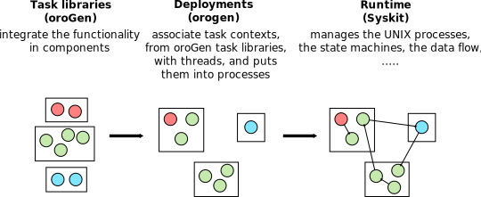

# Writing Components
{:.no_toc}

- TOC
{:toc}

Within Rock, components are _implemented_ in C++. They are also _specified_ in a
Ruby domain-specific language that is processed by a code generation tool,
**oroGen**. This tool ensures that the component's interface matches its
specification. It also removes most of the crude boilerplate-writing code that
is the declaration in C++ of the component interfaces.

From a package point of view, components are defined in an orogen package. The
orogen packages are all placed in the `/orogen/` subdirectory of one of the
[package categories](../workspace/conventions.html). This page will not dwell
on how to create an orogen package. [Check this page out](./orogen_packages.html)
for more details on the subject.

**Important** an oroGen package and a library can share the same basename (e.g.
`drivers/hokuyo` and `drivers/orogen/hokuyo`). This is even a recommended
behavior when an orogen package is mainly tied to a certain library.
{: .note}

Within oroGen packages, the components are named _Task Contexts_. This is
historically the name chosen by the developers of the Orocos RTT toolkit, the
underlying C++ component implementation used by Rock and orogen.

A component is like a black box that you configure, start, feed data to (write
data) to get some data out (read data). This page will give you an overview of how
to create your own, along with the most important guidelines on how to write a
"good" component.

To start building a component, you have to _define its interface_, answering
four questions:

1. what is its name ?
2. what data will it need as input ? (_input ports_)
3. what data will it need as output ? (_output ports_)
4. what data will it need as configuration ? (_properties_)

Once the interface is defined, you can use orogen to generate a C++ scaffold, and
fill the scaffold to actually implement the component.

In summary, the overall development process looks like this:

{: .fullwidth}

1. components are implemented and unit-tested in orogen projects (design and
   implementation)
2. you choose how the components will actually run in your system (deployment)
3. the component is being executed (by Syskit)

## Designing the Interface

The component interfaces are written in the package's `.orogen` file. This section
will first present the role of the major parts of a component interface, to finish
with pointers to other pages for details on how to actually write the component's interface definition.

### The component name

This is the one thing that is painful to change. Changing data types, adding and
removing inputs, outputs or properties is painless. The easiest way to change a
component's name is to copy all the component implementation from one class to
another.

**Guidelines**

- suffix all component names by `Task`
- if the oroGen package you are writing should not have more than one component,
  simply use `Task`
- avoid duplicating the namespace. Almost every place where you will refer to the
  component name will require you to specify the namespace, so it makes names
  only longer. For instance, do not name `camera_gigevision::GigEVisionCameraTask`, but
  simply `camera_gigevision::Task`

### Note about data types

Provided you followed a few rules, oroGen is meant to be using the C++ types you
are using in your libraries directly. This is by far the recommended workflow,
as your components will follow the progress on the library implementation naturally,
without adding to the library code a dependency on orogen-generated code.

### Input and Output Ports

The list of input and output ports is obviously very system-specific. While port names
are relatively easy to change, port _types_ are a rather critical choice.

It is nonetheless generally speaking a very good idea to replicate the naming
scheme used by other components in your system. We only recommend a specific
naming scheme for ports that [generate transformations](geometric_transformations.html).

**Reusing the types is critical**. For an input to be connected to an
output, they need to share the same type. This is the reason why "superset" types
such as for instance Rock's base/samples/RigidBodyState exist. They are here to allow
using a full state estimate with linear and angular position and velocities to be used
for e.g. a simple position.

Also, for this reason, changing a port's type is close to impossible in practice, since
it requires changing the type in all the system(s) the component is being used. What
is done instead is creating another port with the updated type and change step by step,
which is rather effort-consuming (and therefore, avoided in practice)

What has just been said obviously applies only to ports that are meant to be
connected to another component in the system. As we will see, it is a very good
practice to have "status" or "debug" ports in your components. These ports will
only ever be connected to a logger, and for those we usually define a data
structure that is specific to the component being developed.
{: .note}

**Guidelines**

- **group together data that belong together**. Do not create 5 ports to get a piece of
  data because, for instance, you could not find an existing data structure for that
  combination. Re-combining data that belong together is difficult in an asynchronous
  system like Rock.
- **port names need to be unique**, an input cannot be named the same as an output

### Properties

The property interface has a lot less constraints than the ports, especially when
it comes to types. It is really only a contract between Syskit and the
component, that does not involve other components in the system. However, it is
generally speaking good to follow the same naming scheme than other components
of the same kind in your system, for simplicity of development.  As for ports,
it is good to group properties that really belong together in structures, to
avoid creating massive unstructured configuration interfaces.

oroGen allows you to define default parameters for simple types in the specification
directly, and allows you to initialize the more complex types in the C++ code. Always
do so. Always go for "safe" values as defaults, abstracting yourself from the system
you are currently developing as much as possible.

### Actually Writing and Updating the Interface Description

Now is a good time to go read on:

- [how to define types](./defining_types.html)
- [how to import types](./importing_types.html)
- [how to declare a component interface](./interface.html)

Once you have created / updated a `task_context` block, run `amake` to do
code generation and verify that everything is fine. Code generation will create
a C++ class for you to modify in `tasks/`, matching exactly the task context name.

**Implementation Detail**: That class depends on a `Base` class that is managed
*by orogen within the `.orogen/tasks/` folder. This is how orogen manages to update
the task interface after the first generation. There are very few operations that
require a manual change in the `tasks/` folder. They are detailed in the corresponding
documentation.

## Component/Library Separation

We **strongly recommend** that you develop most of your system's functionality
in **libraries**, instead of doing within the component framework itself. For C++, this
means creating C++ library packages that are then later integrated into Rock
components to expose that functionality to the system. For Ruby, this means
creating Ruby packages that are then used within the Ruby layers (e.g. Syskit)

**Why ?** Developing libraries is a matter of "general" software engineering
best practices. Robotics is a small field, software engineering is not. By
doing most of your work in a framework-independent manner, you ensure that you
can benefit from the much bigger ecosystem. Moreover, we haven't seen the end
of the robotic frameworks. By developing libraries that are
framework-independent, you ensure that you can integrate them elsewhere if needs
be, cutting the time and effort by **a lot**.

**How does Rock help the library/framework separation ?** Supporting this
separation during the development process is a main design driver for the
tooling. For instance, Rock's build system - `autoproj` - is not assumed to be
present by the rest of the packages. Second, `orogen` exposes C++ structures
directly into the type system. The widespread approach - using IDLs - usually
end up pushing the developers to integrate code-generated structures in their
libraries thus tying them to the framework itself.
{: .note}

Developing libraries is covered in the [libraries](../libraries) section.
This section deals with using library-integrated functionality and using them
to build data-processing components.

## Implementation

Once the component C++ class has been generated, you need to actually implement it.
Familiarize yourself with the Rock component's

- [state machine](./state_machine.html)
- [how to interact with the interface elements from C++](./writing_the_hooks.html)

And, additionally, re-read the part about [initializing properties](./interface.html#properties)

We recommend that you unit-test your components. Rock has a built-in support using
Syskit as a backend. See [this page](./testing.html).

This documentation also provides pages on specific topics important to robotics:

- [Timestamping of data](./timestamping.html)
- [Handling geometric transformations](./geometric_transformations.html)

## Deployment

In Rock, the _deployment_ is the process to how all these components will be
split in threads, processes and machines. The oroGen layer deals with the first
two, Syskit allows you to handle the third.

In general, with your first components, you will want to keep with [the default
deployment](./deployment.html#default).
