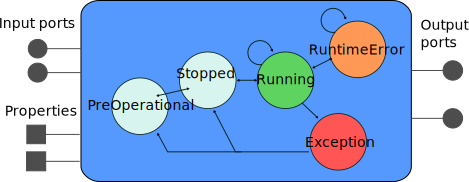

# Component Interfaces
{:.no_toc}

- TOC
{:toc}

We'll cover in this page how to define your task's interface. All statements
presented in this page are to be included in a component definition, i.e.
between 'do' and 'end' in

~~~ ruby
# Documentation of the task context
task_context "ClassName" do
   needs_configuration

   ...
end
~~~

The only constraint on `ClassName` is that it *must* be different from the
project name. How one is meant to interact with these elements in the task's
own code is dealt with [later](writing_the_hooks.html)

The `needs_configuration` statement is historical and should always be present.

## Interface Elements

{: .fullwidth}

 * **Ports** are used to transfer data between the components
 * **Properties** are used to store and set configuration parameters
 * Finally, **Operations** (not represented here) are used to do remote method
   calls on the components

As a general rule of thumb, the components should communicate with each other
only through ports. The properties and operations (as well as the state machine
covered in [the next page](state_machine.html)) are meant to be used by
a coordination layer, namely Syskit in our case.

Documentation for an interface element should be written as a comment directly
on top of the declaration.

### Ports

Ports are defined with

~~~ ruby
# A documentation string
input_port 'in', 'my_type'
# Another documentation string
output_port 'out', 'another_type'
~~~

### Properties

Properties are defined with

~~~ ruby
# What this property is about
property "name", "configuration_type"
~~~

Plain properties **must** be read by the component only before it is started. If
one needs to be able to change the value at runtime, the property must be
declared `dynamic` (see next section)

Properties using simple types (booleans, ints, enums, …) can have a default
value specified directly in the orogen file:

~~~ ruby
# If true, the image is halved
property "downscale_2x", "/bool", false
~~~

For more complex types, the initialization should be done in the task's constructors, e.g.

~~~ cpp
Task::Task(...) {
    _initial_position.set(Eigen::Vector3.Zero);
}
~~~

### Dynamic Properties

Plain properties can't be changed at runtime. They must be set before the
component is configured. To be allowed to change a property at runtime,
declare it as dynamic in the orogen file:

~~~ ruby
# What this property is about
property("name", "configuration_type")
    .dynamic
~~~

**Don't make everything dynamic**. Use dynamic properties only for things that
(1) won't cause unacceptable latency in the component's processing and
(2) for which the "dynamicity" is easy to implement. A counter example is for
instance a device whose change in parameter would take a few seconds. This
should definitely *not* be dynamic. A good example would be a simple scaling
parameter, which is only injected in a numerical equation - that is something
that won't require any internal reinitialization.
{: .important}

By default, a dynamic property will simply be updated in a thread-safe way,
so that the component's runtime hooks (e.g. `updateHook`) can read it safely.
This is fine for simple properties, whose value can be read and applied at each
execution cycle.

For more complex changes, that e.g. require the reconfiguration of the underlying
library (or of the underlying device), it is possible to redefine an automatically
generated virtual method which will be called on update. The method is always named
`set${property_name_with_first_letter_uppercase}`. As always with orogen, in doubt,
just have a look into the `templates/tasks/` folder (once code generation ran after
the addition of the `dynamic` attribute). The task template will contain a default
implementation of this method, for instance:

~~~ cpp
bool PIDTask::setSettings(::std::vector<ActuatorSettings> const & value)
{
    return (motor_controller::PIDTaskBase::setSettings(value));
}
~~~

This default method just calls the default implementation, which will actually update
the value of the property (here `_settings`) and return true to indicate the update
was accepted.

When reimplementing this method, make sure that:

- it returns true if the change was accepted, and that the property object was
  updated accordingly (just call the base method for that)
- it returns false if the new value is not acceptable
- it is error-safe, that is the underlying code should continue to behave
  as-if the value was not changed if an error occurs and the method returns
  false

**This last point** (error-safety) is in itself a good reason to avoid dynamic
properties. Error safety can be rather hard to get right. You've been warned.
{: .important}

The `set` callbacks are **not** automatically called in `configureHook`, only
when the component is running. If you want to call them, for instance because
they do some validatio on the values, you may call the `updateDynamicProperties()`
method which will, and return true if all setters have returned true, or false otherwise.

### Operations

The operations offer a mechanism from which a task context can expose
functionality through remote method calls. They are defined with:

~~~ ruby
# Documentation of the operation
operation('commandName')
    .argument('arg0', '/arg/type')
    .argument('arg1', '/example/other_arg')
~~~

Additionally, a return type can be added with

~~~ ruby
# Documentation of the operation
operation('operationName')
    .returns('int')
    .argument('arg0', '/arg/type')
    .argument('arg1', '/example/other_arg')
~~~

Note the dot at the beginning of all the additional operation definition
statements. This dot is important and, if omitted, will lead to syntax
errors. If no return type is provided, the operation returns nothing.

**When to use an operation ?** Well, don't. Mostly. Operations should very
rarely be used, as they create hard synchronization between components. The one
common case where an operation is actually useful is if something _really
expensive_ needs to rarely be done in the middle of the component processing,
such as dumping an internal state that is really expensive to dump.
{: .important}

### Dynamic Ports {#dynamic_ports}

Some components (e.g. the logger or the canbus components) may create new ports
at runtime, based on their configuration. To integrate within Syskit, it is
necessary to declare that such creation is possible. This is done with the
`dynamic_input_port` and `dynamic_output_port` statements, possibly using a
regular expression as name pattern and either a message type or nil for "type
unknown".

The following for instance declares, in the Rock
[canbus::Task](https://github.com/rock-drivers/drivers-orogen-canbus), that
ports with arbitrary names might be added to the task interface, and that these
ports will have the /canbus/Message type.

~~~ ruby
dynamic_output_port /.*/, "/canbus/Message"
~~~

oroGen currently provides no support for dynamic ports at the C++ level.
`dynamic_output_port` and `dynamic_input_port` are purely declarative, it is
the job of the component implementer to handle their creation and destruction.
This is details [later in this section](writing_the_hooks.html#dynamic_ports)

Syskit expects dynamic ports to be created at configuration time and removed at
cleanup time.

## Inheritance {#inheritance}

It is possible to make the components inherit from each other, and have the
other oroGen features play well.

Given a `Task` base class, the subclass is defined with

~~~ ruby
task_context "SubTask", subclasses: "Task" do
end
~~~

When one does so, the component's subclass inherits from the parent's class, in
the C++ way. This of course means that it has access to the methods defined on the parent
class. From a component point of view, it also means that it inherits the parent's class interface.

When inheriting between task contexts, the following constraints will apply:

 * it is not possible to add a task interface object (port, property, ...) that
   has the same name than one defined by the parent model.
 * the child shares the parent's [state definitions](state_machine.html)

Finally, "abstract task models", i.e. task models that are used as a base for
others, but which it would be meaningless to deploy since they don't have any
functionality can be marked as abstract with

~~~ ruby
task_context "SubTask" do
    abstract
end
~~~

One can also inherit from a task defined by another oroGen package. Import the
package first at the top of the `.orogen` file with

~~~ ruby
using_task_library "base_package"
~~~

and subclass the task from `base_package` using its full name:

~~~ ruby
task_context 'Task', subclasses: "base_package::Task" do
end
~~~

**Next** let's have a look at the component [lifecycle state machine](state_machine.html)
{: .next-page}

