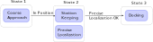

# Action State Machines
{:.no_toc}

- TOC
{:toc}

We have seen so far a way for tasks to emit **events**. That is, "export"
synchronization points on top of which one can build. The action state machines
is a powerful primitive that allows to combine actions temporally, leveraging
the events to do so.

## Concept

While they are called "state machines", the action state machines are between
"pure" state machines and what has recently appeared in the ROS community under
the "behavior tree" name. Which also had the name of HTNs before.

In an action state machine, a "state" is a combination of Syskit actions.
Actions in this case can either be behaviours defined as Syskit definitions,
[action methods](./action_methods.html) or other action state machines. Syskit
will ensure that the set of actions associated with a state runs when that state
is active, and only one state may be active at any given time (in a given action
state machine ... multiple state machines can run in parallel).

As an example, let's use a hypothetical docking maneuver. Medium range, the
maneuver would use an approach that uses a global localization mechanism. When
getting close, the system has to switch to a more precise system. The general
behavior will be to

- approach
- stay in position until the more precise localization system is running and working
- switch to the final docking maneuver

## Declaration

Action state machines are declared in an [action interface](./generalities.html) using
the `action_state_machine` statement. As for action methods, they must be preceded by
a "describe" statement that declares what the action does.

~~~ ruby
module MyApp
    module Actions
        class Navigation < Roby::Actions::Interface
            action_state_machine "docking" do
            end
        end
    end
end
~~~

## States and transitions

A machine's state is based on a single action. Assuming that our docking's
sequence coarse approach is a single profile definition called `docking_coarse_approach`,
we would do

~~~ ruby
action_state_machine "docking" do
    coarse = state docking_coarse_approach_def
end
~~~

You must convert an action into a state object using the `state` statement,
because the same action can be the basis of two different states (which would
allow having different in/out transitions)

If we now assume that the station keeping and final approach actions are
`station_keep_def` and `final_approach_def`, we would define our three main
states with the following snippet. We also tell Syskit which state is the machine's
start state:

~~~ ruby
action_state_machine "docking" do
    coarse = state docking_coarse_approach_def
    station = state station_keep_def
    final = state docking_final_approach_def

    start(coarse)
end
~~~

Let's now assume we have defined a `reached_position` event on the
`docking_coarse_approach_def` action. This event can be the basis of the transition
between `coarse` and `station`:

~~~ ruby
action_state_machine "docking" do
    coarse = state docking_coarse_approach_def
    station = state station_keep_def
    final = state docking_final_approach_def

    start coarse
    transition coarse.reached_position_event, station
end
~~~

The `reached_position` event should **not** be a terminal event for
`docking_coarse_approach`, i.e. it should not be terminating the task. Syskit is
far from being a realtime engine, so each action should have a "stable" end
state. In this case, I would design `coarse_approach` to actually hover at the
target point. It may make the `station` state useless unless `station_keep` does
it better. We will see how we could do without the station keep action later.
{: .note}

Now, during the `station` state, we want to run the localization method that
will be used during the final approach, and make sure it works before we go
for the final approach (for instance, that it found visual markers). Such combination
of actions in a state is a staple of the actions state machines:

~~~ ruby
action_state_machine "docking" do
    coarse = state docking_coarse_approach_def
    station = state station_keep_def
    localization = state visual_localization_def
    final = state docking_final_approach_def

    start coarse
    transition coarse.reached_position_event, station
end
~~~

However, `visual_localization_def` should be running the localization, but won't
be providing us with the events we need for our synchronization. It is common to
build a library of tiny steps for this. In this case, we would create a
`validate_visual_localization` action that would run the action and emit success
once the visual location has a hit. We can then use the success event for our
purposes

~~~ ruby
action_state_machine "docking" do
    coarse = state docking_coarse_approach_def
    station = state station_keep_def
    # States can be made of any action, not only of profile definitions.
    # Here `validate_visual_localization` is built on top of the
    # visual_localizations_def (see paragraph above)
    validate = state validate_visual_localization
    station.depends_on(validate)
    final = state docking_final_approach_def

    start coarse
    # Since reached_position_event is an event of a state, you do not need
    # to specify the state, i.e. the following is equivalent to
    # transition coarse, coarse.reached_position_event, station
    transition coarse.reached_position_event, station
    transition station, validate.success_event, final
end
~~~

Because of how Syskit handles transitions, the visual localization network will
remain unchanged between the station and final states.
{: .note}

Finally, we would build the final_approach_def action to emit `success` when docked,
which would become the success criteria for the state machine itself:

~~~ ruby
action_state_machine "docking" do
    coarse = state docking_coarse_approach_def
    station = state station_keep_def
    validate = state validate_visual_localization
    station.depends_on(validate)
    final = state docking_final_approach_def

    start coarse
    transition coarse.reached_position_event, station
    transition station, station.validate_child.success_event, final
    final.success_event.forward_to success_event
end
~~~

## Parameters

The action state machine may take arguments of its own. They are declared the same way
than with [action methods](./action_methods.html#definition), that is using the
`required_arg` and `optional_arg` statements to `describe`. The arguments are then
made available with `_arg` accessors and can thus be used as arguments to the underlying
actions.

As an example, let's assume we want to parametrize the target point for the `coarse`
and `station` states:

~~~ ruby
describe("action that docks")
    .required_arg(:target, "the target point as { x:, y:, z: } object")
action_state_machine "docking" do
    coarse = state docking_coarse_approach_def(target: target_arg)
    station = state station_keep_def(point: target_arg)
    validate = state validate_visual_localization
    station.depends_on(validate)
    final = state docking_final_approach_def

    start(coarse)
    transition coarse.reached_position_event, station
    transition station, station.validate_child.success_event, final
    final.success_event.forward_to success_event
end
~~~

## Using Dynamic Data - Captures

It is sometimes useful to get information passed from one action to another. This is
done through a combination of event and arguments. I.e. the action state machines provide
you with the means to 'read' data associated with an event and use it to compute another
state's argument.

Indeed, tasks, when emitting events, may "attach" an object to them (the "event
context"), e.g.

~~~ ruby
success_event.emit(some_data)
~~~

In action state machines, the event's context can be captured and transformed into
another state's argument with the `capture` statement:

~~~ ruby
c = capture(my_state.success_event) do |event|
    data = event.context.first # 'context' is an array
    ... convert `data` into something usable as an argument ...
end
state some_action(target: c)
~~~

As an example, let's assume we want to use a generic line follower to go from
the current system position to the coarse approach target. We would read the
current system position first and then transition to the line follower:

~~~ ruby
describe("action that docks")
    .required_arg(:target, "the target point as { x:, y:, z: } object")
action_state_machine "docking" do
    acquire_pose = state acquire_pose_def
    from = capture(acquire_pose.success_event) do |pose|
        p = pose.position
        { x: p.x, y: p.y, z: p.z }
    end

    coarse = state follow_line(from: from, to: target_arg)
    station = state station_keep_def(point: target_arg)
    validate = state validate_visual_localization
    station.depends_on(validate)
    final = state docking_final_approach_def

    start(acquire_pose)
    transition acquire_pose.success_event, coarse
    transition coarse.reached_target_event, station
    transition station, validate.success_event, final
    final.success_event.forward_to success_event
end
~~~

If repeated, the "go there using a line from the current position" can be
factored in a separate action state machine, using the state machine's support
to get custom events:

~~~ ruby
describe("go to a target following a line from the current position")
    .required_arg(:to, "the target point as { x:, y:, z: } object")
action_state_machine "follow_line_from_here" do
    acquire_pose = state acquire_pose_def
    from = capture(acquire_pose.success_event) do |pose|
        p = pose.position
        { x: p.x, y: p.y, z: p.z }
    end
    line = state follow_line(from: from, to: target_arg)

    start acquire_pose
    transition acquire_pose.success_event, line

    event :reached_target
    line.reached_target_event reached_target_event
end

describe("action that docks")
    .required_arg(:target, "the target point as { x:, y:, z: } object")
action_state_machine "docking" do
    coarse = state follow_line_from_here(to: target_arg)
    station = state station_keep_def(point: target_arg)
    validate = state validate_visual_localization
    station.depends_on(validate)
    final = state docking_final_approach_def

    start coarse
    transition coarse.reached_target_event, station
    transition station, validate.success_event, final
    final.success_event.forward_to success_event
end
~~~

### The Acquire functor

`bundles/common_models` defines the `Acquire` "functor" that creates a composition
suitable to follow the "acquire data and pass it to success" pattern. Acquire takes
a component model and will emit `success` once it received data on all of its ports.

For instance, one use the following definition to read the global pose:

~~~ ruby
define "acquire_global_pose",
       CommonModels::Compositions.Acquire(Services::Pose)
       .use("data_source" => global_pose_def)
~~~

## Dynamic State Machine Creation

State machines can be defined at toplevel, the way we just saw, but may also be
defined dynamically in an [action method](./action_methods.html). When doing so,
one has to first define a root task and attach the machine to that task. For
instance,

~~~ ruby
root_task = MyActionMethodRoot.new
action_state_machine root_task do
end
root_task
~~~

The `action_state_machine` block behaves the same than in "toplevel" state
machines, but has access to instance methods and action method arguments
directly.

## Testing

State machines defined at toplevel are evaluated at loading time, and the presence
of actions and events is validated at loading time as well.

Therefore, there are only mainly two points that are needed to test in relation
with action state machines:

- captures
- dynamically generated state machines

### Captures

In the action interface's test suite, create the state machine's task instance
and then use `run_state_machine_capture` to execute the capture:

~~~ ruby
task = run_planners my_action(x: 5, y: 10)
result = run_state_machine_capture task, "capture_name", context: [42]
~~~

In the rare occasion that the capture would need some more information from the
event, pass a full `Roby::Event` as the `event` argument instead of `context`

### Dynamically Created State Machines

To test that a state machine was properly generated, create the toplevel task and
then use the `validate_state_machine` helper to get into a context that allows
you to "play" with the machine's state tasks:

~~~ ruby
it "transitions to 'coarse' once the pose is acquired" do
    interface = MyInterface.new
    root_task = interface.some_action
    validate_state_machine root_task do
        next_task = assert_transitions_to(:state_name) do |current_task|
            # Act on 'current_task' using the normal test primitives, e.g.
            # syskit_configure_and_start, expect_execution, ...
        end
    end
end
~~~

Do not get into the trap of testing the states themselves, the "test space" will
get very big very quickly. The point of these tests is to check the state
machine's own structure. Test each state's implementation in separate unit tests.
{: .warning}

