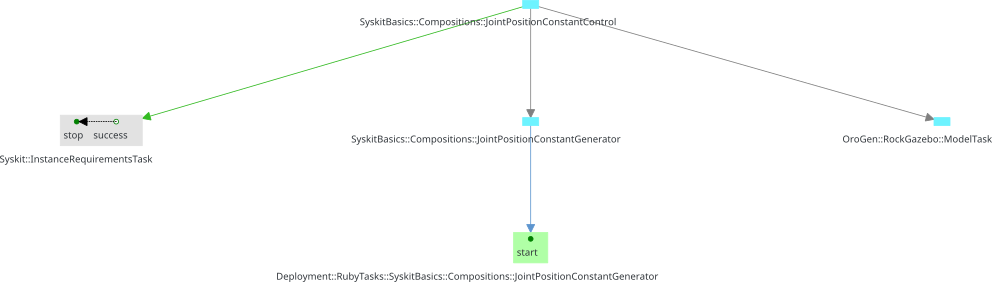

# Generalities
{:.no_toc}

- TOC
{:toc}

All the actions within a Syskit are all the "things" the system can do. The
actions are gathered within "action interfaces", which are repositories of
actions that "work together". They are all subclasses of `Roby::Actions::Interface`.
A template interface can be created with `syskit gen action`. The
corresponding file lies in `models/actions/` and its tests in `test/actions/`

The only way we know how to create new actions, so far, is by exporting component
networks through [profiles](../component_networks/profiles.html). Component
networks defined in profiles can be "exposed" as actions with the `use_profile`
statement. Each definition gets a corresponding action named `${defname}_def`,
which we have seen for instance in [the syskit IDE](../basics/deployment.html#running-the-simulation-and-app).

~~~ ruby
module MyApp
    module Actions
        class Navigation < Roby::Actions::Interface
            use_profile Profiles::Navigation
        end
    end
end
~~~

Actions from an interface can be made available in another with the `use_library`
statement

~~~ ruby
module MyApp
    module Actions
        class UI < Roby::Actions::Interface
            use_library Navigation
        end
    end
end
~~~

## The Main action interface

One predefined action interface class is special, as it is the one that is available
globally, the Main interface. It is available as `${AppName}::Actions::Main`. It
is the interface that you set up with the `Robot.actions` block [in the robot
configuration](../basics/deployment.html#actions).

One usually only adds actions there using the `use_profile` and `use_library`
statements, as e.g.

~~~ ruby
Robot.actions do
    use_profile MyApp::Profiles::Base
    use_library MyApp::Actions::UI
end
~~~

## Actions, tasks, missions and jobs {#missions}

Just a bit of vocabulary ...

- **actions** are the definition of "something" the system can do. They are
  **instanciated** when they are added to the plan for execution
- the **plan** is the data structure in which Syskit manages all the system's
  runtime state. It is essentially a [graph of tasks](../runtime_overview/task_structure.html)
- **tasks** are the basic building block used to track execution of parts of
  the system. Compositions and components are tasks. Tasks emit and receive **events**,
  which is the unit of control and monitoring.
- **missions** are tasks that have been marked as "important". They represent
  the current goal(s) of the Syskit system, and are used by [the garbage
  collection](../runtime_overview/index.html) to determine what should be stopped.
- **jobs** are missions which have a job ID assigned to them. Only jobs are shown
  in UIs such as the Syskit IDE.

In addition, when instanciated, an action is represented by a single task in
the plan. This task will often be the root of a subplan, that is a set of
other tasks that actually implement the action.

All actions work this way: they generate a single "root" task, and create a
network of other tasks that support it. Syskit does this from component network
definitions. One can also do it manually in e.g. [action methods](action_methods.html).

For instance, the [`arm_cartesian_constant_control_def` action](../basics/devices.html#profile_define) is represented by its
[toplevel composition](../runtime_overview/task_structure.html#dependency). This task is
the one task that is registered as a mission in the plan.

## Instanciating actions

Within action interfaces, actions are only _definitions_ of what the system can do.
To run them, one needs to instanciate them and add them to Syskit's plan.
Manually, one can use the Syskit IDE or the syskit shell to start an action.
Programatically, they can be added in two ways:

- using the `Robot` global interface with the `Robot.action_name!(arg: ...)`
  syntax. For instance, the following would look for a `go_to` action on the main
  interface and activate it

  ~~~ ruby
  Robot.go_to!(x: 10, y: 20)
  ~~~

- by adding the action to the plan manually, for instance:

  ~~~ ruby
  Roby.plan.add_mission_task(
      MyApp::Actions::Navigation.go_to(x: 10, y: 20)
  )
  ~~~

## What happens when actions are instanciated

When instanciated, any action is first added into the plan as a **planning
pattern**. This is a pair of tasks:
- one task that represents the action itself in an abstract way,
- one task that represents the creation of all the tasks necessary to
  actually execute the action. This is called the planning task.

For instance, adding a definition to a plan creates a task of the same type than
the definition's toplevel, and a planning task of type `Syskit::InstanceRequirementsTask`

{: .fullwidth}

Then Syskit's [scheduler](../runtime_overview/event_loop.html#scheduling) will first
have to execute the planning task, which will replace the planned task (the
action-represented-in-an-abstract-way task) by the actual tasks that can be executed:

{: .fullwidth}

Which will then be scheduled (again) by Syskit's scheduler.

This representation has two advantages:

1. it allows to explicitely order the plan generation (the planning step) using Syskit's
   [event scheduling primitives](event_scheduling.html)
2. it allows to do resolve all the planning tasks of a certain kind globally, as it is
   done by e.g. Syskit to resolve the component network taking into account everything
   that should be running in the whole system (network_generation.html)

## What happens when missions are dropped

Dropping a mission is telling Syskit that the mission is not anymore an
objective of the system. Syskit will terminate anything that is not in use by
other missions, but leave the rest of the system alone.

## "Restarting"

In the Syskit IDE, "restarting" a job is dropping it and creating a new one
_at the same time_. When dealing with stateless actions (i.e. all profile
definitions), this essentially does nothing:

- _dropping_ the current mission is marking it as "not needed"
- _creating_ the same mission with the same arguments will make syskit deploy it
  and generate a network that is exactly like the currently running one
- since the current network and the old ones are identical, Syskit will just keep
  the current system.

To actually restart the current component(s), you need to drop and then start.

## Refining and reusing existing actions

Generally speaking, action interfaces can be refined and reused.

"Refined" means to "tune" the actions for specific systems, or to provide the
implementation of abstract actions that were defined for the purpose of
creating higher-level behaviors (e.g. state machines) without getting into
the specifics of how these behaviors will be executed. This is done by
subclassing the "parent" interface, usually while keeping the name but
placing it into the specific system's namespace, for instance, in
`models/actions/navigation.rb`:

~~~ ruby
module Generic
    module Actions
        class Navigation < Roby::Actions::Interface
        end
    end
end
~~~

is then refined for a `gazebo` robot configuration in simulation by creating
`models/actions/gazebo/navigation.rb` this way:

~~~ ruby
require "generic/models/actions/navigation"

module MyApp
    module Actions
        module Gazebo
            class Navigation < Generic::Actions::Navigation
            end
        end
    end
end
~~~

"Reused" means to create composite actions using actions from other
interfaces, but without the ability of changing the reused actions. This is
done with the `use_library` statement. For instance, the `Navigation`
interface we just refined can be reused in a `UI` action interface which
defines all the actions available to a control UI:

~~~ ruby
require "my_app/models/actions/gazebo/navigation"

module MyApp
    module Actions
        module Gazebo
            class UI < Roby::Actions::Interface
                use_library Navigation
            end
        end
    end
end
~~~

These techniques usually lead to a double refine & reuse pattern, where
the generic abstract actions are linked with a `use_library` and then refined
by subclassing and again a `use_library`:

{: .fullwidth}
