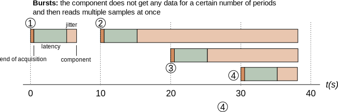

# Data and Timestamps
{:.no_toc}

- TOC
{:toc}

One major design difference between component systems commonly found in the software
engineering community and the ones developed by the robotics community is that, in the
former, interaction between components is mostly done through messaging and protocols
(synchronous or asynchronous RPC) while, in the second one, the dominant model is the one
of dataflow (one-way transmission of data samples). The main reason for that difference is
that the consensus in the robotics community is to see the component layer as a data
processing layer, i.e. a set of mingled pipelines in which data flows and gets
processed, while the software engineering community is more focussed on business
processes, in which transmission of information needs to be done through two-way protocols.

In other words: in robotics, when it comes to develop components, _data is king_. The
major implication of that, when one develops a robotic toolchain, is that both tools and
components need to be designed so as to handle the issue raising with data, originating
from the world and being processed in an asynchronous way _but in realtime_.

This has a lot of ramifications. We will deal with in this page with the one that has
the most impact on writing libraries and components for the robotics world: _timestamping_.
A related issue, the one of time-ordered data processing, will be dealt with [in the dataflow
design](../dataflow_design/stream_aligner.html) section.

## Timestamping

Since robotics is all about managing physical systems that evolve in a physical
environment, and modify it, the relationship between the data that are being processed and
this environment is central to the problem of data processing. Key to that is the ability
to associate data temporally: the ability to mark when a particular information was
sensed from the physical world. This process is usually referred as _timestamping_.

In the following example, since the two data acquisition pipelines have
(tremendously) different processing times, the point cloud generated from the
stereo pair and the IMU readings _that have originate from the same point in
time in the real world_ are going to reach the pose estimator component at very
different times. It is therefore important for the pose estimation component to
be able to know their actual order _in the real world_. This is what data
timestamping is meant to achieve: not mark when a particular data structure has
been filled, but when the information contained in this data structure was
sensed in the real world.

{: .fullwidth}

Moreover, at the output of the pose estimator, the generated pose should also be
timestamped properly, i.e. mark the time at which the pose estimate was the pose
of the robot _in the real world_. Most estimation algorithms do provide this information
(they provide a timestamped best estimate).

It is unfortunately a not so well understood issue. Indeed, a recurrent idea is
that the framework itself could timestamp data. Which it could, but only if it
had a model of how information propagates through the components -- something
that to our knowledge none of the mainstream frameworks does.

From an abstract point of view, the main guidelines about timestamps are:

- not having a timestamp in a data stream should be the exception, not the norm
- for a data sample, the timestamp represents the time at which the data was
  valid _in the real world_. In simple processing pipelines, the timestamp of the
  output is usually the timestamp of the processed input. Withing data fusion,
  the fusion   algorithm usually tell us what's the timestamp (e.g. a Kalman
  filter produces the best estimate for the sample received at the last update
  step).
- control samples are a different matter. A good timestamp would general
  timestamp would be the time of the feedback that was used to generate the
  control sample. Pipelines should propagate the timestamp. This provides
  a measurement of the latency of the whole loop, which is a critical aspect.

## Estimating and Improving Acquisition Timestamps

Let's look at a standard data acquisition process in a robotic system. As we
already stated, our goal is to estimate, as closely as possible, _when_ the
data has been acquired by the sensor. Assuming a system with four sensors: an
IMU, a laser scanner and two cameras (for the purpose of explaining the
timestamping process, only the IMU will be used).

Ideally, timestamping would match the sensor acquisition times:

{: .fullwidth}

However, timestamping the data that originates from the sensors is a task that
is hindered by phenomenons in the data acquisition chain: sensor acquisition
process, communication between the sensor and the CPU, operating system
scheduling (when the driver process gets executed once the data arrived) and --
last but not least -- clock synchronization in multi-CPU (and therefore
multi-robot) systems.  Fortunately for us, a few of these can be estimated
offline and/or online.

This estimation of the time difference between an event and when this event is
measured is commonly separated between a mean _latency_ (constant part)
and a _jitter_ (variability).

{: .fullwidth}

Since most sensors have a fixed acquisition period, the jitter can be filtered
out over time by estimating the average sensor period and base time. In Rock,
this is done by the `aggregator::TimestampEstimator` class [that is
described later on this page](#timestamp_estimator)

The average latency, however, is a different issue altogether. It
originates from different sources, each of which have to be solved by different
means:

__Sensor__ the latency in the sensor acquisition process is usually documented (or
can at least be informally given by the company producing this sensor). In case of sensors
developed in-house, this value can be estimated.

__Communication layer__ a rough estimate can usually be obtained by looking at the
amount of data and the communication layer bandwidth.

__Operating system__ is the weak part of the chain if one does not use a
hard-realtime operating system such as Xenomai or QNX _or_ has devices that are
not compatible with that realtime operating system. However, some communication layers timestamp
messages at the driver level (for instance, CAN and firewire stacks on Linux systems). For other layers, no
information can be obtained directly.

__Clock synchronization__ clock synchronization solutions like NTP are available
to synchronize multiple CPUs. However, they take long to converge, especially over
wireless networks (if they converge at all), making it practical only on systems that are
up most of the time. Additionally to NTP, outdoors, one can use GPS as a time source.
Indoors, no really good solution exist to our knowledge.

__Throwing hardware at the task__ It became common for sensors used in robotic
applications to have so-called hardware synchronization signals that announce a particular event (for instance,
start of acquisition), or hardware triggers that allow to pick the point of acquisition
(common on cameras). Using adapted hardware and combined with the techniques proposed
above, this method allows to achieve data timestamping of the order of one milliseconds,
regardless of the operating system properties. The TimestampEstimator class also
accepts a separate stream of timestamps that it is using to estimate the
latency. Check out the next page for details.

## Timestamps in Rock data types

Timestamped data samples within Rock's base types are all defined within the
`/base/samples` namespace, and provide a first field called `time` of type
`/base/Time`. For historical reasons, commands are usually not timestamped. Do
add one following the same When applicable (that is, mostly all the time), the
Rock data types

## Filtering Latency with the Timestamp Estimator {#timestamp_estimator}

The TimestampEstimator class, which lies in the aggregator package, is used to
remove the jitter out of a periodic time stream. Basically, once configured, one
gives it a time in a time series that (1) is periodic (2) can (rarely) contain
lost samples and/or bursts, and returns the best estimate for the provided
time.

One design criteria for this class is that it has to be zero-latency, i.e. the
timestamp estimator never delays the processing of a sample.

To use it, one first adds the aggregator package in the list of dependencies
and adds the corresponding `using_library` statement in the orogen file.  In
addition, in order to track how the filter behaves, one should create in
addition a status port, on which estimation-related statistics are output:

The `manifest.xml`:

~~~ xml
<depends package="drivers/orogen/aggregator" />
~~~

In the toplevel of the orogen file:

~~~ ruby
using_library "aggregator"
import_types_from "aggregator"
~~~

An in the `task_context` definitions:

~~~ ruby
output_port 'timestamp_estimator_status',
  '/aggregator/TimestampEstimatorStatus'
~~~

On the C++ side, one declares an `aggregator::TimestampEstimator` instance
variable in the task's header (not forgetting to include
`aggregator/TimestampEstimator.hpp`). This object will be configured in
`configureHook` and reset in the `startHook`.

At creation time, only one parameters is required: the estimation window. The
timestamp estimator continuously estimates the device period by averaging the
duration between successive samples on a certain time window. For stability
reasons, that time window should be chosen pretty big (~ 100 periods or more).
If your device period is known to drift, you should choose a window that is at
most 10% of any significant drift time (i.e. if the period changes more than
10% after 10s, the window should be at most 1s)

Additionally, it is recommended to provide the expected device period. At
initialization, the estimator does not have any information about the time
stream it has to estimate, which makes it initially very sensible to jitter
(i.e. the estimated times will be pretty bad). Providing an expected period --
which is usually available from the device type and configuration -- improves
the initial estimation quite a lot.

As an example, the setup of the Xsens IMU, when configured at 10Hz, would be:

~~~ cpp
mTimestamper = aggregator::TimestampEstimator(
    base::Time::fromSeconds(10),
    base::Time::fromMilliseconds(10));
~~~

Then, in the updateHook, one gets its best estimate with:

~~~ cpp
data = mDriver->getSample();
data.time = mTimestamper.update(data.time);
_timestamp_estimator_status.write(mTimestamper.getStatus());
~~~

Do __not__ forget to reset the estimator in the startHook

~~~ cpp
mTimestamper.reset();
~~~

All is well and good for now … as long as no samples get lost or unexpectedly
delayed.  The main issue here being that delayed samples look very much -- from
the point of view of the estimator -- like lost samples.

Let's take our IMU, and see a realistic case for latency and jitter during execution:

{: .fullwidth}

In this example, when the component receives sample 3, how can it know whether it __is__ sample
3 or sample 4 ? Indeed, sample 3 is received __after__ the expected minimum
reception time of sample 4, so it could either be sample 4 early or sample
3 very late.

In case of actual bursts (i.e. when the component receives multiple samples at
once), the same issue arises: since the estimator is not allowed by design to
store samples.

{: .fullwidth}

This situation can ideally be solved by indexes provided by the sensor. Some
sensors count how many samples it generated so far and provides this information
**inside the data stream itself**. In this case, this index can be explicitly
provided to the estimator (__you have to be careful about wraparounds__).

~~~ cpp
data.time = mTimestamper.update(
  data.time, mDriver->getIndex());
~~~

Finally, if you have a mean to determine data loss other than the index, you can
announce lost samples to the estimator:

~~~ cpp
mTimestamper.updateLoss();
~~~

If no external means to determine loss is available, the estimator itself has a
threshold-based mechanism to choose between the lost sample case or the delayed
sample case. The last parameter of the constructor provides a loss_limit number
of periods:

 * if a sample i+1 is received and t(i+1) - t(i) <= P*loss_limit, then the
   estimator will think that the sample has been delayed
 * if a sample i+1 is received and t(i+1) - t(i) > P*loss_limit, then the
   estimator will think that one sample has been lost.

The loss threshold is provided as the third argument to the constructor. It is
recommended to define a property called `sample_loss_threshold` of type `/int`
to give some control over this option. The default value for it should be 2
(unless your device, by itself, has a bursty behaviour).

~~~ ruby
# Loss threshold for the timestamp estimator
property "sample_loss_threshold", "int", 2
~~~

This property is passed to the constructor in the `configureHook`:

~~~ cpp
mTimestamper = aggregator::TimestampEstimator(
    base::Time::fromSeconds(10),
    base::Time::fromMilliseconds(10),
    _sample_loss_threshold.get());
~~~

The last bit of the puzzle is the integration of hardware-provided timestamps.

As we already explained, a lot of sensors nowadays provide hardware pulses that
announce a precise event in their data acquisition process. If such a source is
available to you, you can feed it to your component by creating a e.g.
`hardware_timestamps` port of type `/base/Time` and feed this to the estimator:

~~~ ruby
input_port "hardware_timestamps", "/base/Time"
~~~

~~~ cpp
base::Time hw_time;
while (_hardware_timestamps.read(hw_time) == RTT::NewData)
    mTimestamper->updateReference(hw_time);
~~~

That's all on the topic of timestamping. Let's move on to
[deployment](deployment.html), to find out how the components classes we're
writing are actually executed 
{: .next-page}
