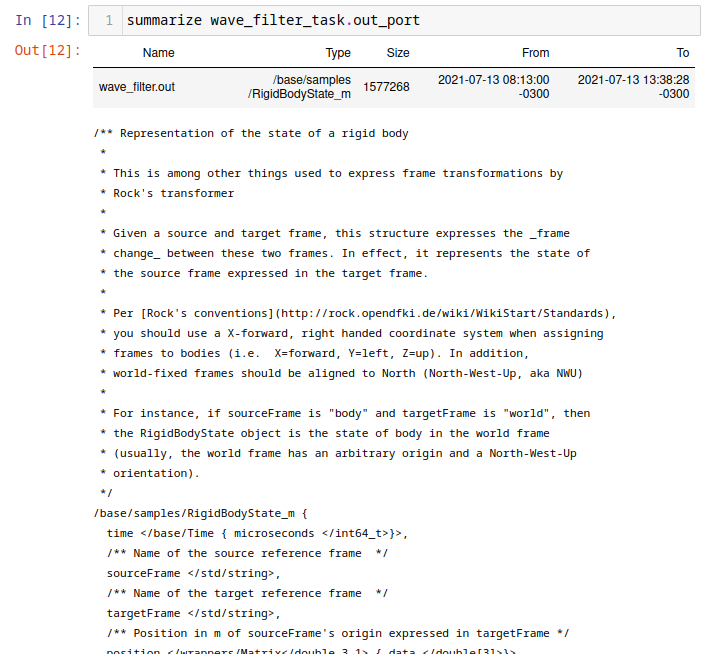
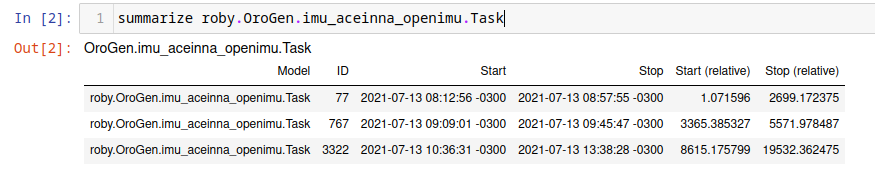
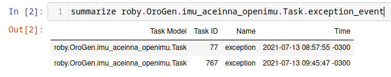

# Log Analysis using Jupyter
{:.no_toc}

- TOC
{:toc}

The [rock.jupyter](https://github.com/rock-core/rock.jupyter-package_set)
generates a Jupyter configuration to have a Ruby kernel matching the version
from the package set. To add it to your workspace, add the package set in the
`package_sets` section of your `autoproj/manifest`, the `rock.jupyter.osdeps`
metapackage to the manifest itself.

~~~ yml
package_sets:
- ...
- github: rock-core/rock.jupyter-package_set

manifest:
- ...
- rock.jupyter.osdeps
~~~

and run `autoproj osdeps`

To start using Jupyter within your Rock workspace, either start
`jupyter-notebook` after having loaded the workspace's env.sh, or start it with
`autoproj exec`, e.g.

~~~
.autoproj/bin/autoproj exec jupyter-notebook
~~~

At this point, you may create a notebook that uses a Ruby kernel. If you have set
the `SYSKIT_LOG_DATASTORE` [environment variable](datastore.html), this kernel
will use that datastore by default.

TODO: screencast

This support is aimed at relatively simple plotting and analysis. If your goal
is to perform very advanced processing (such as e.g. machine learning), we
recommend to use functionality described in this guide to extract the data you
need, but then export it into something other languages with bigger data
analysis ecosystems (e.g.  Python, R, ...) can load. Everything that is being
done here can be done in a single Ruby script.

The general workflow is:

- select a dataset
- restrict the processing time interval and/or specify a subsampling
- convert the streams of interest into a [daru](https://github.com/sciruby/daru)
  dataframe
- plot/analyze the extracted data or save it for further analysis in other languages

In addition, the DSL supports using Syskit event data to find sections of the
dataset that are of interest. This is a very powerful mean to provide context to the
raw data, as Syskit tasks/compositions, in the end, describe the system's intents.

## Preamble

Add the following in the first cell of the notebook, to load the notebook support:

~~~ ruby
require "syskit/log"
require "syskit/log/dsl"
extend Syskit::Log::DSL
~~~

`Syskit::Log::DSL` is designed to ease analysis of a single dataset. Load the
dataset by its ID with the following statement. We **strongly** recommend that
this statement is the last of a cell, as it will display details about the
dataset, such as the list of tasks, ports and properties it contains.

~~~ ruby
dataset_select "SOME_DATASET_ID"
~~~

After this statement, all other statements will use that dataset.

## Transforming log streams into data frames

### For a single stream

The `to_daru_frame` statement is a one-stop command to convert many log streams
into a single data frame, aligning the data using the log streams' timestamps.
We will first see how it works for a single stream, and go on with multiple
streams just afterwards.

Within the DSL, reference to ports are of the form
`task_name_task.port_name_port` when passed as argument to `to_daru_frame`. For
instance, assuming we had a pose estimator task called `pose_estimator` in the
system, with a `pose_samples` port, one would do the following to create a frame
from it.

~~~ ruby
frame = to_daru_frame pose_estimator_task.pose_samples_port do |p|
    ...
end
~~~

The list of tasks and ports is displayed by `dataset_select` when it is last in
a cell.

The `p` object yield above by `to_daru_frame` represents a sample generated by
the port, and allows to create columns in the generated dataframe, based on
fields in the data type. The data type is the typelib type (i.e. C++ type or
intermediate type in a case of opaques), **not** the associated ruby type. See
[this page](../components/types_in_ruby.html)

In our example, assuming the pose is a RigidBodyState, to get the X, Y and Z coordinates of the position:

~~~ ruby
frame = to_daru_frame pose_estimator_task.pose_samples_port do |p|
    p.add("x") { |s| s.position.data[0] }
    p.add("y") { |s| s.position.data[1] }
    p.add("z") { |s| s.position.data[2] }
end
~~~

`RigidBodyState` being derived from opaque types, the data structure we are
manipulating here is the one showed as "Logging type" on the type page in
the Syskit IDE:

Alternatively, within the Jupyter notebook, one can use `summarize` to get
details about a port's data type:

~~~ ruby
summarize pose_estimator_task.pose_samples_port
~~~

If you want to use some methods from the Ruby type that is used to represent a
Rock type, you may use the transform method. For instance, to create a column
containing a RigidBodyState heading, do

~~~ ruby
frame = to_daru_frame pose_estimator_task.pose_samples_port do |p|
    p.add("yaw") { |s| s.orientation.transform(&:yaw) }
end
~~~

`RididBodyState.orientation` is converted first to its Ruby equivalent
(`Eigen::Quaternion`) for which Rock defines a `yaw` method. Note that you should
do this only if it is not possible to perform the data on the column afterwards.
If you wanted to scale a column from radians to degress (for plotting later), it
is significantly faster to compute the scaling afterwards:

~~~ ruby
frame = to_daru_frame trajectory_controller_task.heading_command_port do |p|
    p.add("target_angle") { |s| s.angle.rad }
end
~~~

frame["target_angle"] = frame["target_angle"] * 180 / Math::PI
~~~

Daru, the underlying dataframe handling library supports most basic numerical
computations on columns, as well as some more useful sliding-window operations
such as mean/stdev, ...

### For multiple streams

When given more than one port, `to_daru_frame` will align them all to the first
port. In practice, it means that it generates new lines in the frame whenever
there is a new sample for the first port, and fills the rest of the columns with
the last sample of the other streams it found just before. The selection of the
first port is therefore, rather obviously, critical.

Right now, alignment is done with the log stream's logical time, which is the
time when the sample was received by the logger.

For instance:

~~~ ruby
df = to_daru_frame \
    trajectory_controller_task.heading_command_port, \
    pose_estimator_task.pose_samples_port do |cmd, pose|

    cmd.add("cmd_heading") { |s| s.orientation.transform(&:yaw) }
    pose.add("x") { |s| s.position.data[0] }
    pose.add("y") { |s| s.position.data[1] }
end
~~~

### Dealing with missing data

By default, when aligning multiple streams, `to_daru_frame` will always use the
last received sample for any given stream, regardless of how old it is. The optional
`timeout` parameter allows to "reset" this value after a time (in seconds) and use
the column's no-data value (which is nil for categorical data and NAN for numerical
data)

Let's assume for instance that the pose stream we have used in the above examples
have a straing 10Hz period, without skip. However, the heading command has "holes"
whenever the heading controller was not in use (for instance). The following definition
will make sure that the `cmd_heading` column is filled with NaNs whenever this was
the case:

~~~ ruby
df = to_daru_frame \
    pose_estimator_task.pose_samples_port,
    trajectory_controller_task.heading_command_port, timeout: 1 do |pose, cmd|
    pose.add("x") { |s| s.position.data[0] }
    pose.add("y") { |s| s.position.data[1] }
    cmd.add("cmd_heading") { |s| s.orientation.transform(&:yaw) }
end
~~~

Note that the alignment happens on the first stream given as parameter. If we were
to change the order of the ports in the call to `to_daru_frame`, the sections without
data in that stream would instead not appear at all.

### Subsampling

To do rough analysis or plotting of long datasets, the analysis DSL allows to
configure subsampling parameter using the `interval_sample_every` statement. It
can be given in number of samples (e.g. `interval_sample_every samples: 10`) or
time between samples (e.g. `interval_sample_every seconds: 0.2`).

One thing to consider when aligning streams is that subsampling happens to
streams independently (before alignment)

## Using Syskit data

Syskit execution data is also available within the notebooks, to provide context.
This allows to find where things are in the timeline, a critical aspect when one
has to deal with hours or even days of data in a single dataset.

The simplest form is to list instances of a given task (task context, ruby task
context, composition) model using `summarize`.

Given an orogen model `aceinna_imu::Task`, one does

~~~ ruby
summarize roby.OroGen.imu_aceinna_openimu.Task
~~~

which lists the instances of that particular task. It works for task contexts as well
as compositions and ruby tasks.

Then, to restrict further processing to the interval of an instance of that
particular task, one does

~~~ ruby
interval_select roby.OroGen.imu_aceinna_openimu.Task.by_id(767)
~~~

Alternatively, particular events might be of more interest, for instance

~~~
summarize roby.OroGen.imu_aceinna_openimu.Task.exception_event
~~~

Gives

which can then used to restrict the processing interval.

## Plotting using Vega

The `syskit-log` Jupyter helpers have functionality geared towards plotting using
vega-lite (through a thin Ruby wrapper).

The simplest helper, `vega_simple_plot`, does a X/Y plot based on a Daru frame, e.g.

~~~
vega_simple_plot(df, x: "t", y: "velocity")
~~~

Under the scenes, daru and vega have very different data representations. The dataframe
is first converted in an array of hashes and then plotted. If multiple plot are to be
made based on the same data, it is best to convert them first with `daru_to_vega`:

~~~
df_vega = daru_to_vega(df)
vega_simple_plot(df_vega, x: "t", y: "velocity")
~~~

Layering simple plots can be done with

~~~
Vega.lite.data(df_vega).layer([
    vega_simple_view(x: "t", y: "velocity"),
    vega_simple_view(x: "t", y: "x_velocity"),
])
~~~

`layer` can be replaced by `vconcat` to have plots vertically stacked and `hconcat`
to have them horizontally aligned.

Generally speaking, the vega-rb layer maps the vega-lite specification in a rather
straightforward way. Use [Vega Lite's documentation](https://vega.github.io/vega-lite/)
as a reference.

For reference, `vega_simple_plot` and `vega_simple_view` are roughly equivalent to

~~~
Vega.lite.encoding(x: { field: "t", type: "quantitative" },v
                   y: { field: "velocity", type: "quantitative" })
         .mark(type: "line").width(800)
~~~

## Annotating plots with Syskit task data

The `ruby_vega_mark_tasks` call is a very powerful way to tag vega data with the
ID and name of a Syskit task. This would allow to e.g. change the color or style based on
the system's currently selected behavior.

For instance, let's assume we have a `df` dataframe converted into a `df_vega` Vega data
array, and we want to visualize with of the tasks contained in a `current_missions` array
is currently active. One would do:

~~~
roby_vega_mark_tasks("current_mission", df_vega, *current_missions, time_field: "t")
~~~

The call will add a "current_mission" field in each sample with a string that describes
the task running at the time of the sample (contained in field "t"). Then the following:

~~~
vega_simple_plot(x: "t", y: "rudder_angle", color: nil)
    .encoding(color: { field: "current_mission" })
~~~

would create a X/Y plot with the color of the line determined by the current task. The
task list is displayed in the legend. For instance:

The `roby_task_timeline` also allows to simply plot a timeline of the given tasks
(as a horizontal bar graph).

## Limitations

- all processing to data frames is done in the sample's logical time (time when it
  reached the logger) instead of the sample's own time. The long term objective is
  to write the latter into the former during normalization.