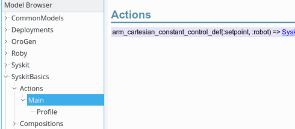

# Deployment

A few things are missing before we can actually run [the network we just
created](devices.html):

1. [Deploy the components](#use_deployment)
2. [Configure the components](#configuration)
3. [Export the network as a Syskit Action so that we can instruct Syskit to start it](#actions)

## Component deployment {#use_deployment}

When declared in oroGen files, components are an encapsulation of a
function. At this stage, a "component" is really just a class which embeds code
in a specific, normalized way, and that has defined inputs, outputs and
configuration parameters.

To actually run a component, one needs to declare how it will be supported by
the operating system's runtime ressources (how the components are mapped to
processes and threads), and when the component will be processing its data
(periodically, triggered by its inputs). Moreover, the component is given a name
so that it can be discovered by Rock's inspection tools, and so that its outputs
can be found in the data logged at runtime.

All oroGen components have a default deployment scheme of one component per
process. The triggering mechanism does not have a default, but the
`port_driven` scheme (where the component is triggered whenever data is
received on its inputs) is a very common scheme. If you look into the
`cart_ctrl_wdls` package, you would see that it's what the package's components
use.

One usually starts with the defaults defined in the oroGen file. We therefore
only have left to give a name to the components Syskit is using. This is done
in the robot's config file with:
{: #requires}

~~~ruby
Robot.requires do
  Syskit.conf.use_gazebo_world('empty_world')

  require 'models/profiles/gazebo/arm_control'
  Syskit.conf.use_deployment 'cart_ctrl_wdls::CartCtrl' => 'arm_pos2twist'
  Syskit.conf.use_deployment 'cart_ctrl_wdls::WDLSSolver' => 'arm_twist2joint'
  Syskit.conf.use_deployment 'robot_frames::SingleChainPublisher' => 'arm_chain_publisher'
  Syskit.conf.use_ruby_tasks SyskitBasics::Compositions::ArmCartesianConstantCommandGenerator => 'arm_constant_setpoint'
  Syskit.conf.use_ruby_tasks SyskitBasics::Compositions::JointPositionConstantGenerator => 'joint_position_setpoint'
end
~~~

Now that we've required our toplevel profile in the robot configuration file,
we can inspect our app using the IDE by simply providing the `-rgazebo` flag.
Only new files, not yet required by the config file, must be specified on the
command line.
{: .callout .callout-info}

## Component configuration {#configuration}

Configuration of components in a Syskit system is split into two parts:

- "dynamic" configuration: parameters that cannot be known at design time, will
  be changed each time an action is started, or are to be kept consistent
  system-wide (such as e.g. information that can be extracted from the SDF
  model). These are represented as **task arguments**. This is how the
  setpoint
  of the cartesian controller [is handled](constant_generator.html).
- "static" configuration: parameters that are known at design time. Most
  of the algorithm parameters fit into this category. These are the subject
  of this section.

### Static configuration of oroGen components

The static configuration is stored within YAML files in `config/orogen/`. Each
file is named after the component model that is configured, so for instance
`config/orogen/cart_ctrl_wdls::WDLSSolver` stores the configuration of all
components under that name. Each file can contain multiple configurations
within sections, but for now we'll only use the `default` configuration,
which is the one that is loaded by default unless specified otherwise.

Let's generate configuration file templates for the components we are using. The
files are generated with the default configuration exposed by the components.

~~~
$ syskit gen orogenconf cart_ctrl_wdls::WDLSSolver
      create  config/orogen/
      create  config/orogen/cart_ctrl_wdls::WDLSSolver.yml
$ syskit gen orogenconf cart_ctrl_wdls::CartCtrl
      exists  config/orogen/
      create  config/orogen/cart_ctrl_wdls::CartCtrl.yml
$ syskit gen orogenconf robot_frames::SingleChainPublisher
      exists  config/orogen/
      create  config/orogen/robot_frames::SingleChainPublisher.yml
~~~

The generators create a configuration file for each component class, containing the default value of every property.
Let's look at them one by one, to see what needs to actually be configured.

- `cart_ctrl_wdls::WDLSSolver`. There are robot model parameters as well as tip
  and root. The former should be extracted from the SDF configuration, but the
  tip and root have to be set. The only algorithm parameter that does not seem to
  have a sane default is the `lambda` parameter. The documentation mentions 0.1
  has a known-good parameter for some arm, let's pick that and keep in mind
  that it might be wrong.
- `cart_ctrl_wdls::CartCtrl`. The one parameter that is probably best changed is
  the max output. The component's designer decided to pick `RigidBodyState` to
  represent a twist, which means that we only need to update the velocity
  and angular velocity fields. Let's set `0.1` in linear and `2.deg` in angular
  (the `.deg` suffix will convert a degree value in radians).
- `robot_frames::SingleChainPublisher` only has robot model that we will
  extract from the SDF model, and the tip/root parameters that have to be set

**Note** in order to ensure consistency between the tip and root parameters of
`SingleChainPublisher` and `WDLSSolver`, another way to handle this is to make
them parameters of the compositions.
{: .callout .callout-info}

The root and tip in our case are the base and hand of the robot. The link names are prefixed
with the model name (here, `ur10_fixed`) so `root` should
be `ur10_fixed::ur10::base` and `tip` should be `ur10_fixed::ur10::wrist_3`. One can find this out by looking at
the SDF file.  Alternatively, the chain can be
inspected using the `rock-transformer` tool:

<iframe width="853" height="480" src="https://www.youtube.com/embed/ShYmPgIZ1Oc?rel=0&amp;showinfo=0" frameborder="0" allowfullscreen></iframe>

### Dynamic and system-wide configuration

The robot model need to be extracted from the SDF and passed to the components
that require it. The convention when integrating SDF models in Syskit is to
extract the relevant parts of the XML model as an XML string and provide only
this to the components. This centralizes the difficulty of resolving the
relationships between SDF models, and provides flexibility to tune the model
before it is passed to the component.

<a class="btn btn-warning" role="button" data-toggle="collapse" href="#sdf_load" aria-expanded="false" aria-controls="sdf_load">
  Advanced
</a>Mechanisms involved in SDF file loading in Rock

The difficulty when loading a SDF file is that SDF allows files to refer to
each other through the include mechanism, which can be used in a
[world](http://sdformat.org/spec?ver=1.6&elem=world#world_include) as well as a
[model](http://sdformat.org/spec?ver=1.6&elem=model#model_include) tag. Within
Gazebo, the include tags are resolved by searching through the
`GAZEBO_MODEL_PATH` environment variable. The SDF integration in Syskit automatically
augments this environment variable with the `models/sdf/` folders found within the [app search path](getting_started.html#syskit_gazebo_configuration).

In order to avoid complexities tied to this mechanism, the preferred way to integrate SDF in components in a Syskit system is to provide the XML model as a string instead of as a file. This ensures that Syskit and the components share the same model.

The `use_sdf_model` statement stores the model object on the profile object.
The most natural way would be to pass the `Base` profile, that represents the
robot model, as a `robot` argument to the control compositions until the oroGen
components. We can then make sure that argument is passed to the oroGen components
themselves.

We've already seen [how to forward a composition argument to its child](constant_generator.html#composition_forward_argument), so let's apply that to the compositions:

In `models/compositions/arm_cartesian_constant_control_wdls.rb`

~~~ruby
class ArmCartesianConstantControlWdls < Syskit::Composition
  # The robot model that is to be used
  #
  # This must be the enclosing profile object that has the use_sdf_model call
  #
  # @return [Profile]
  argument :robot
  ...
  add(ArmCartesianControlWdls, as: 'control').
    with_arguments(robot: from(:parent_task).robot)
end
~~~

and in `models/compositions/arm_cartesian_control_wdls.rb`

~~~ruby
class ArmCartesianControlWdls < Syskit::Composition
  # The robot model that is to be used
  #
  # This must be the enclosing profile object that has the use_sdf_model call
  #
  # @return [Profile]
  argument :robot
  ...
  add(OroGen::CartCtrlWdls::WDLSSolver, as: 'twist2joint_velocity').
    with_arguments(robot: from(:parent_task).robot)
  add(OroGen::RobotFrames::SingleChainPublisher, as: 'joint2pose').
    with_arguments(robot: from(:parent_task).robot)
end
~~~

Since the `ArmControl` profile is specific to the `gazebo` robot, we can inject
the relevant robot in the profile directly:

~~~ruby
define 'arm_cartesian_constant_control',
  Compositions::ArmCartesianConstantControlWdls.
    use(Base.ur10_fixed_dev).
    with_arguments(robot: Base)
~~~

We now need to modify the oroGen component models to use the robot argument.
Since oroGen components are auto-generated by Syskit, there's a special
mechanism to allow modifying the generated classes after the fact. When Syskit
loads an oroGen package, and after it has created the task classes, it will attempt to
load a file named like the project in `models/orogen/`. In the case of the
`robot_frames` project, this would be `models/orogen/robot_frames.rb`.
{: #orogen_extension_files}

In the IDE, when displaying a task model under the `OroGen` namespace, a project
that has no associated extension file in `models/orogen/` has the following message:

Let's do exactly that

~~~
$ syskit gen orogen cart_ctrl_wdls
      create  models/orogen
      create  test/orogen
      create  models/orogen/cart_ctrl_wdls.rb
      create  test/orogen/test_cart_ctrl_wdls.rb
$ syskit gen orogen robot_frames
      exists  models/orogen
      exists  test/orogen
      create  models/orogen/robot_frames.rb
      create  test/orogen/test_robot_frames.rb
~~~

After hitting the IDE's reload button, we now get the path to the extension file:

Now, let's edit `models/orogen/cart_ctrl_wdls.rb`. There is one `class`
statement per task model in the project, but we're currently only interested in
the `WDLSSolver` task. Let's add the `robot` argument, and tune the
`configure` method that is described in the template to forward the model on to
the task's properties.

~~~ruby
class OroGen::CartCtrlWdls::WDLSSolver
  argument :robot
  def configure
    super # call super as described in the template

    properties.robot_model = robot.sdf_model.make_root.to_xml_string
    properties.robot_model_format = :ROBOT_MODEL_SDF
  end
end
~~~

and in `models/orogen/robot_frames.rb`:

~~~ruby
class OroGen::RobotFrames::SingleChainPublisher
  argument :robot
  def configure
    super # call super as described in the template

    properties.robot_model = robot.sdf_model.make_root.to_xml_string
    properties.robot_model_format = :ROBOT_MODEL_SDF
  end
end
~~~

Now, to ensure consistency, we should verify that the `tip` and `root`
properties are set to actual links in the provided model. Let's do this in
`WDLSSolver`:

~~~ruby
argument :robot

# @api private
#
# Validates that a link is part of the provided robot model
#
# @param [String] link_name the name of the link
# @param [String] property_name the name of the property being
#   verified
# @raise [ArgumentError] if the link is not in the model
def verify_link_in_model(model, link_name)
  if !model.each_link.any? { |link| link.full_name == link_name }
    raise ArgumentError, "link name '#{link_name}' is not a link of the robot model. Existing links: #{model.each_link.map(&:full_name).sort.join(", ")}"
  end
end

def configure
  super

  # Extract the model into its own SDF document
  as_root = robot.sdf_model.make_root
  # And get the new model
  model = as_root.each_model.first
  verify_link_in_model(model, properties.root)
  verify_link_in_model(model, properties.tip)

  properties.robot_model = as_root.to_xml_string
  properties.robot_model_format = :ROBOT_MODEL_SDF
end
~~~

<a class="btn btn-warning" role="button" data-toggle="collapse" href="#lib_helpers" aria-expanded="false" aria-controls="lib_helpers">
  Advanced
</a>Writing helpers in Syskit apps

The `verify_link_in_model` functionality is obviously a good target for
being factored out as a standalone helper. In Syskit apps, these helpers
are stored within the `lib/<app_name>/` folder (e.g. `lib/syskit_basics/`).
Corresponding tests are stored in `test/lib/`.

In this case, one would create a `lib/syskit_basics/sdf_helpers.rb` file with a `SyskitBasics::SDFHelpers` module that contains

~~~ruby
# Validates that a link is part of the provided robot model
#
# @param [SDF::Model] sdf_model the SDF model
# @param [String] link_name the name of the link
# @raise [ArgumentError] if the link is not in the model
def self.verify_link_in_model(sdf_model, link_name)
  if !sdf_model.each_link.any? { |link| link.name == link_name }
    raise ArgumentError, "link name '#{link_name}' is not a link of the robot model. Existing links: #{sdf_model.each_link.map(&:name).sort.join(", ")}"
  end
end
~~~

As for the constant generator, we should [test the
functionality](constant_generator.html#testing).  The `syskit gen orogen` call
created a test template. Let's modify it to test the setup for `WDLSSolver`.
The modifications for `SingleChainPublisher` will be left to the reader :P

~~~ruby
describe WDLSSolver do
  attr_reader :profile

  before do
    # Create a mock that has a robot model
    xml = <<-EOSDF
      <model name='test'>
        <link name="root_test" />
        <link name="tip_test" />
      </model>
      EOSDF
    # We don't really need a full profile object, only an object
    # that provides a Model object from a '#sdf_model' attribute
    #
    # Let's fake one using flexmock. Flexmock is loaded as part
    # Of Syskit's test harness
    #
    # https://github.com/doudou/flexmock
    @profile = flexmock(sdf_model: SDF::Model.from_xml_string(xml))
  end

  it "sets the robot model from its 'robot' argument" do
    # Create a fake test configuration with valid root and tip
    syskit_stub_conf WDLSSolver, 'default',
      data: { 'root' => 'test::root_test', 'tip' => 'test::tip_test' }
    task = syskit_stub_deploy_and_configure(
      WDLSSolver.with_arguments(robot: profile))
    assert_equal "<sdf>#{profile.sdf_model.to_xml_string}</sdf>",
      task.properties.robot_model
  end

  it "raises if the root link does not exist" do
    syskit_stub_conf WDLSSolver, 'default',
      data: { 'root' => 'invalid', 'tip' => 'test::tip_test' }
    e = assert_raises(ArgumentError) do
      syskit_stub_deploy_and_configure(
        WDLSSolver.with_arguments(robot: profile))
    end
    assert_equal "link name 'invalid' is not a link of the robot model. Existing links: test::root_test, test::tip_test",
      e.message
  end

  it "raises if the tip link does not exist" do
    syskit_stub_conf WDLSSolver, 'default',
      data: { 'root' => 'test::root_test', 'tip' => 'invalid' }
    e = assert_raises(ArgumentError) do
      syskit_stub_deploy_and_configure(
        WDLSSolver.with_arguments(robot: profile))
    end
    assert_equal "link name 'invalid' is not a link of the robot model. Existing links: test::root_test, test::tip_test",
      e.message
  end
end
~~~

And run the tests either [on the command line](constant_generator.html#run_test_command_line) or [with the IDE](constant_generator.html#run_test_ide).

The tests for `WDLSSolver` we just wrote should pass. However, we get an error for `AdaptiveWDLSSolver`:

~~~
  1) Error:
OroGen::CartCtrlWdls::AdaptiveWDLSSolver#test_0001_anonymous:

cannot find an ordering to configure 1 tasks
OroGen::CartCtrlWdls::AdaptiveWDLSSolver:0x5e5bbb8
  owners: 
  arguments: 
    orocos_name: "task_under_test",
    conf: ["default"]
  ready_for_setup? false
  missing_arguments: robot
  has no should_configure_after constraint
    /home/doudou/dev/vanilla/rock-website/tools/syskit/lib/syskit/test/network_manipulation.rb:788:in `syskit_configure'
    /home/doudou/dev/vanilla/rock-website/tools/syskit/lib/syskit/test/network_manipulation.rb:1023:in `syskit_deploy_and_configure'
    /home/doudou/dev/vanilla/rock-website/tools/syskit/lib/syskit/test/task_context_test.rb:63:in `assert_is_configurable'
    /home/doudou/dev/vanilla/rock-website/tools/syskit/lib/syskit/test/task_context_test.rb:75:in `is_configurable'
    /home/doudou/dev/vanilla/rock-website/bundles/syskit_basics/test/orogen/test_cart_ctrl_wdls.rb:55:in `block (2 levels) in <module:CartCtrlWdls>'
~~~

With the `missing_arguments:` line [we've already seen](constant_generator.html#missing_arguments).

Looking at `AdaptiveWDLSSolver`, we can see that it is subclassing `WDLSSolver`:

This is reflected in the class hierarchy on the Syskit side, which means that
`AdaptiveWDLSSolver` does inherit the `configure` method we just wrote. Given
that it does not overload this method itself, we can just delete the test.

## Building the system's action interface {#actions}

A Syskit application exports functionality to the outside world as _actions_.
For now, the only thing we'll see about actions is that they have a name,
arguments and a lifetime. They either finish by themselves -- if they have a
goal -- or run forever until they are "dropped" by the app's user.

What we will see here is how to export the [profile
definition](devices.html#profile_define) as an action on the robot's action
interface so that we can finally start it.

Every robot have a 'main' interface that is setup in the robot configuration
file. Syskit profiles are added in the action interface there, so that their
definitions are exported as an action with a `_def` suffix.

Let's modify the `actions` block in `config/robots/gazebo.rb` to have:
{: #main}

~~~ruby
Robot.actions do
  use_profile SyskitBasics::Profiles::Gazebo::Base
  use_profile SyskitBasics::Profiles::Gazebo::ArmControl
end
~~~

**Note**: the profile is available in the actions block because [we've required it in the requires block](#requires)
{: .callout .callout-info}

After modifying the config file, the IDE needs to be quit and started again. We
can then look at the `Main` interface and see that it indeed has `_dev` actions for
the devices in `Base`, and `_def` actions for the definitions in `ArmControl`.

Let's now run it

## Running the simulation and app

Start the simulation with

~~~
rock-gazebo empty_world
~~~

Once started, the simulation can stay running regardless of whether the Syskit
app itself gets restarted. You can then start the app using the IDE, and
send the command through the Syskit shell. The following video show you the process. Its goal
is to give you a feeling for Syskit's runtime workflow. Detailed explanations will come later [in the runtime part of this documentation](../syskit_runtime/index.html)

<iframe width="853" height="480" src="https://www.youtube.com/embed/wXYb7f_xNZo?rel=0&amp;showinfo=0" frameborder="0" allowfullscreen></iframe>

Before we move on to the Syskit runtime aspects, [let's recap what we've just seen](recap.html){:.btn .btn-primary}
