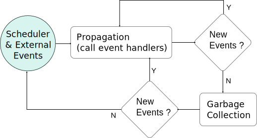

# Syskit's event loop

This page will be the first one that will go deeper in Syskit's execution
model. This one will present Syskit's event loop structure, detailing how
things like configuring, starting or stopping components is sequenced
during Syskit's execution.

## Events, Reactor, Synchronous and Asynchronous

Fundamentally, Syskit's execution is event-based and based on the reactor
pattern. External events are received and Syskit does "other things" in
reaction to their happening. Most common reaction is to call a piece of code
registered as a _handler_ for the event. Schematically:

{: .fullwidth}

Unlike common event-based programming environments, Syskit does not only
_react_ to events, but can also _cause_ them. Some events, such as the start
and stop events of components are _controllable_, which means that Syskit can
make them happen instead of only waiting for them to happen, by calling a piece
of code called the _event command_.

Within Syskit, events are _propagated_. This means that Syskit tries to
maintain a synchronous model in which within the same propagation, events can
cause the emission of other events (within for instance an event handler). The
new events are then propagated which …. For instance, compositions do not have
to do anything to "be started". Therefore, the _start_ event is emitted at the
moment it is called. This propagation is **synchronous**, the whole propagation
is done within a single event cycle.

This event propagation is done **within a single thread**. Which means that
computation within event commands and handlers will block the propagation. To
avoid issues with e.g. blocking network calls, Syskit has infrastructure to
execute remote calls **asynchronously**. The event command executes in a
separate (blocking) thread and the event emission is delayed until that command
finishes, possibly in a new event cycle.

## Scheduling

The scheduler is an object responsible to determine which _start_ commands can
be executed at the beginning of a given cycle, and to execute them. Syskit's
default scheduler is the temporal scheduler. We will see some characteristic of
this scheduler in this section.

First and foremost, a component can be scheduled only if:

- it has all its parameters set. This is a common problem, that some arguments
  are unset and the network does not run. This can be caught [in
  tests](../syskit_basics/constant_generator.html#missing_arguments). At
  runtime, in the IDE, this is leads to the following message:

  TODO: missing argument in IDE

- its [execution agent](task_structure.html#execution_agents) is ready. Agents
  are expected to have a _ready_ event that is emitted when the agent reached a
  state where the components it supports can be executed.

In addition, the basic scheduling rules are:

- a component may be started only if at least one of its parents [in the
  dependency relation](task_structure.html#dependency) is running (the _start_
  event has been emitted).
- a component may be started only if all its inputs are connected

To illustrate this, let's have a step-by-step look at the startup of the safe
pose job. Try to notice where the cycle boundaries happen.

TODO: step-by-step of safe pose.

Under these rules, the semantic of "a component is running" is to represent
that the system has  the _intent_ to achieve its role, but not that it actually
does execute that role (yet): the component's children may not run yet. For
instance, a running safe position composition represents that the system has
the intent to reach that position, but it will not be reaching that position
until the composition's constant generator and arm model are running. This will
be an important distinction when building more complex, coordinated systems.
{: .callout .callout-warning}

Note that this is a simplification that is "good enough" for now. These are
default rules, that can be overridden explicitly on a case-by-case basis. There
will be more about this in [the coordination part](../syskit_coordination/).
{: .callout .callout-info}

## Component Lifecycle, Configuration, Startup and Shutdown

Rock components have a lifecycle of their own. This lifecyle is what makes a
generic coordination of them possible: one can expect a standardized behavior.

The lifecycle of a single component is a state machine that looks like this
(without error states represented):

{: .fullwidth}

This is the lifecycle of a single component. Sequencing of the startup and
shutdown of a network is more complicated, and it relies on assumptions that
make it possible to determine when to connect, configure or start a component.

1. Component's `configure` transition is expected to mostly be standalone -
   i.e. not rely on other components. The exception to this rule are devices
   that rely on data bus components (e.g. a CAN device on a CAN bus).
2. Components have the ability to create new ports dynamically, which is
   usually controlled by their configuration. Syskit may therefore not expect
   all ports to be available before the component is configured. Syskit
   restricts dynamic port creation to `configure`, and their destruction to
   `cleanup`.
   
With these assumptions, Syskit can generically sequence the startup and
shutdown of a component network:

TODO: component network sequencing

All actions that involve a direct interaction with the component (sending the
start command, writing properties, …) are done asynchronously in separate
threads, and will be done in parallel if more than one component are being
setup. All actions that involve code written within the Syskit app itself are
executed sequentially within the main thread.

## Garbage Collection

The garbage collection recursively stops tasks that are not useful for an
active job, as in the following video. Note again the event cycle boundaries,
and how they mark a difference between synchronous stops (compositions) and
asynchronous ones (external components):

TODO: video step by step garbage collection

## Component Reconfiguration

As [already mentioned](task_structure.html#usefulness), external processes are
marked as permanent by default within Syskit. One of the main reasons is that
configuration of an external component may be fairly expensive (load maps,
precompute expensive data structures, configure a device, …), and Syskit
therefore attempts to reduce how often they are required.

When configuring components, Syskit will attempt to `cleanup` and `configure` a
given component only if the component's configuration changed since the last
configuration. Otherwise, it will only have to start it. `cleanup` is also done
asynchronously to avoid blocking the main thread execution.

In the following video, we change the configuration file for our cartesian
controller, reload the configuration and trigger a redeploy. We then see how
this triggers a reconfiguration:

TODO: video change configuration

Another source of reconfiguration is to transition between two networks that
select different component configurations. Let's create two controller
configurations in `config/orogen/cart_ctrl_wdls::WDLSSolver.yml`:

~~~yaml
~~~

and two networks using these two different configurations in
`models/profiles/gazebo/arm_control.rb`:

~~~
~~~

We can then transition between the two and see the component be reconfigured:

TODO: video

We've seen so far how things work _nominally_. Let's see [how Syskit reacts when
things go wrong](exceptions.html){:.btn .btn-primary}.
