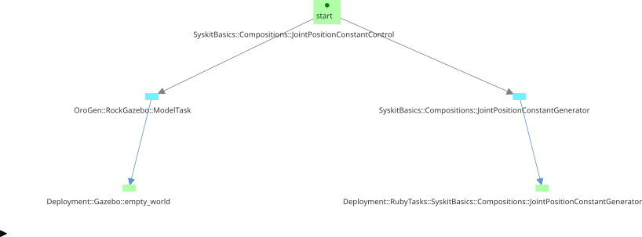
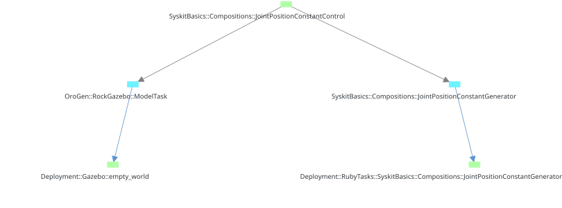
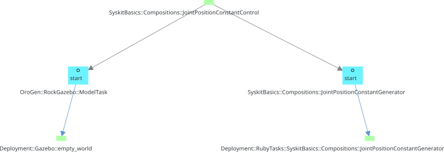
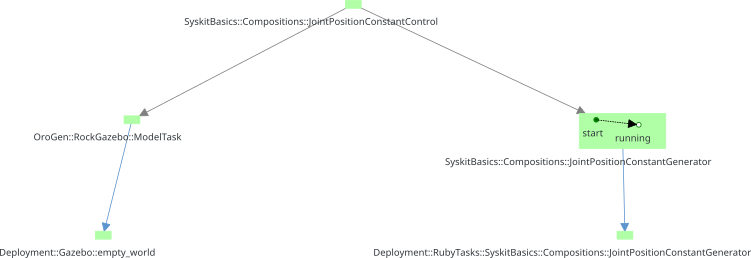

# Syskit Runtime Behavior

This part of the documentation deals with the Syskit "runtime model", that is
how Syskit manages a system at runtime, the underlying mechanisms of execution
and how a user can interact with a Syskit system.

Later on this page, I will give a high-level explanation of [the video we've
seen at the end of the Basics
section](../syskit_basics/deployment.html#final_video). We will then get deeper
into each part of Syskit that handle Syskit's runtime behavior: an overview of
the [Syskit execution](event_loop.html) and of [error
representation and common type of errors](exceptions.html)

This is the first part that will deal with runtime aspects. For more advanced
related topics, one may want to also read all about
[coordination](../syskit_coordination/index.html).

## Actions and Jobs

In the [Basics](../syskit_basics) part, we've seen how to define network of
components on a profile, and that this profile could be then exposed on an
action interface, which allowed us [in the last
part](../syskit_basics/deployment.html) to control the system.

An _action_ is an abstract concept that represents one thing the system can do.
In order to actually have it executed, one starts a _job_. In the shell we've
seen in the video, this is done with the `action_name!(arguments)` syntax.
Once a job has been started it has a job ID that is displayed both by the IDE
and by the shell. This job ID can then be used to kill the job with `kill_job
JOB_ID`.

All job-related commands are processed in batches: they are queued and only
sent to the Syskit app when the `process` command is entered. We will see the
reason for this later.

## Starting and Stopping

Starting the first two jobs from the IDE seemed to be a very transparent
process. However, behind the scenes, even this seemingly simple actions require
a bunch of things, such as (in no particular order):

- connecting to the Gazebo task that handle our arm model
- creating the joint constant generator task
- connecting the two
- configuring and starting the components

The sequencing of these different actions is controlled by Syskit's
**scheduler**. While the overall scheduler could be in principle arbitrary,
Syskit internally relies on services that are currently provided by
the temporal scheduler (that you had to set [in the initial bundle
setup](../syskit_basics/getting_started.html#initial_setup)). Startup of
the `arm_safe_position_def` job looks like this:

  <!-- Indicators -->
  <ol class="carousel-indicators">
    <li data-target="#job_start_step_by_step" data-slide-to="0" class="active"></li>
    <li data-target="#job_start_step_by_step" data-slide-to="1"></li>
    <li data-target="#job_start_step_by_step" data-slide-to="2"></li>
    <li data-target="#job_start_step_by_step" data-slide-to="3"></li>
    <li data-target="#job_start_step_by_step" data-slide-to="4"></li>
    <li data-target="#job_start_step_by_step" data-slide-to="5"></li>
    <li data-target="#job_start_step_by_step" data-slide-to="6"></li>
    <li data-target="#job_start_step_by_step" data-slide-to="7"></li>
    <li data-target="#job_start_step_by_step" data-slide-to="8"></li>
    <li data-target="#job_start_step_by_step" data-slide-to="9"></li>
  </ol>

  <!-- Wrapper for slides -->
  

    

    

    

    

    

    

    

    

    

  

  <!-- Controls -->
  <a class="left carousel-control" href="#job_start_step_by_step" role="button" data-slide="prev">
    
    Previous
  </a>
  <a class="right carousel-control" href="#job_start_step_by_step" role="button" data-slide="next">
    
    Next
  </a>

Now, let's look at stopping things.

If we have the two initial jobs running (`ur10_fixed_dev` and
`arm_safe_position_def`) and stop the latter first and then the former. Focus
on the right panel, that shows the state of the "real" components (i.e. not the
compositions).

<iframe width="853" height="480" src="https://www.youtube.com/embed/DBsJxvX1rVs?rel=0&amp;showinfo=0" frameborder="0" allowfullscreen></iframe>

When `arm_safe_position_def` was stopped, only the setpoint generator
`joint_position_setpoint` has been stopped. The `ModelTask`
`gazebo:empty_world:ur10_fixed` is still running. This is because we still have
the `ur10_fixed_dev` action running and that this action "depends on" the
component. When we stop `ur10_fixed_dev`, this one is stopped as well.  At the
end, starting the `arm_safe_position_def` by itself starts both components, and
stopping it stops both.

Syskit maintains a set of components and compositions that are currently in use
by its goals. Everything else is "not useful" and stopped. This relies on two
things: the internal relationships between compositions and components which
tracks the "usefulness" of a task, and a garbage collection mechanism that
stops and removes not-useful tasks.

In a nutshell, so far:

- "starting" or "killing" a job is actually either adding a new goal
  or removing an existing goal from Syskit's goal set
- the scheduler is what actually starts things based on this goal set
- the garbage collector is what actually stops things based on this goal set

## Transitions

One of Syskit's most important features is its ability to transparently
_transform_ the component network to build one or a combination of behaviors.
We have seen this interactively in the video we saw [at the end of the Basics
section](../syskit_basics/deployment.html#final_video): the system was maintaining the
`arm_safe_position_def` and we transitioned it into a parametrized
`arm_cartesian_constant_control_def` to move its tip into a given cartesian
position. This entailed changing the network from a simple joint command to a
network that can do cartesian arm control. What we saw was that the transition
happened smoothly: the arm was controlled during the change of system
configuration.

The same mechanisms are key to autonomously transitioning between behaviours,
which we will see in the [coordination](../syskit_coordination/index.html) part
of this documentation.

When we transitioned from the joint control to the cartesian control, I've sent
first a `action_name!` command to start an action, and a `kill_job` command to
stop the running joint control action. These two commands were displayed by the
shell as follows:

{: .fullwidth}

The header says `2 actions queued in the current batch, use #process to send,
#cancel to delete`. `#process`. When I sent `process`, the two were processed
_together_. That is, Syskit could understand that the intent was to stop an
action and start a new one _at the same time_, which it handled as a transition.

Syskit's execution engine acts as an **event loop**, in which all events that
are received at the same time are processed _as if_ they happened at the exact
same time.

So, what would have happened if I sent the `kill_job` first and then the
`arm_cartesian_constant_control_def!` ? Syskit would have applied the kill
_first_ and then the start. We would have basically had the same effect than in
[the video we just saw](#start_stop_video), with the arm falling uncontrolled.

Now, what would have happened if I instead I sent the
`arm_cartesian_constant_control_def!` and only then the `kill_job` ?

<iframe width="853" height="480" src="https://www.youtube.com/embed/LkmR9AFo5ek?rel=0&amp;showinfo=0" frameborder="0" allowfullscreen></iframe>

Ouch … The start command failed. This is because we've tried to run two
different control chains that controlled the same device. This is an
impossibility, and the request is therefore rejected by Syskit's **network
generation**.
{: #deployment_failure}

We'll now get to understand all of this step-by-step, starting with [Syskit's
task structure](task_structure.html){: .btn .btn-primary}, how Syskit maintains
what is and isn't useful in the system (among other things …)

