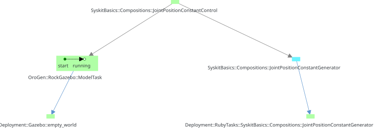

# Task Structures

Key to the scheduler and garbage collection mechanisms is Syskit's ability to
maintain the set of components that are useful for the currently active jobs.

Internally, Syskit maintains a set of directed graphs that represent the
relationship between the components. These graphs are built so that the target
of an edge is "useful" to the source of the edge. Obviously, this "usefulness"
relationship is transitive, that is the target-of-a-target is useful to the
root.

In addition to representing a notion of usefulness, these relations also generally
encode temporal relationships between the tasks. This page will hint at these, but
we will see it later on [when we talk about exceptions](exceptions.html).

## Dependency Graph {#dependency}

We've actually already seen one of these graphs: the _dependency graph_ is what
binds compositions to the composition children.  The tree structure we can see
in the IDE when displaying information about a composition is a representation
of this graph. The composition child (target in the edge) is useful to the
parent (the source):

{: .fullwidth}

An edge in this graph encodes that the child must be "running" for its parent
to function nominally.

Note that the dependency graph is not necessarily a tree. A task can be shared
among multiple functions, that is have multiple parents.
{: .callout .callout-info}

## Execution Agents {#execution_agents}

The other graph that is of importance for us right now is the _execution agent_
graph.  It represents a "execution support" relationship between a component -
the one that is being executed - and the process that is actually executing it
- the agent.

The composition is therefore the source and its child the target. The agent is
the target. In Syskit, this is used to represent the link between a component
and the process that is actually "containing" it, such as Gazebo for our
`ModelTask`, or the deployment of an orogen component. The two `Deployment::`
tasks below are the agents for the corresponding components:

{: .fullwidth}

The agent relationship is a lot stronger than the dependency relation. When a
child in a dependency relation stops, the function can be recovered by e.g.
simply restarting the child. If a component's agent dies, the component _is
already dead_. This is unrecoverable.

## Jobs, Permanent Tasks and Usefulness {#usefulness}

We've already seen the jobs. Internally, Syskit simply remembers that a certain
set of components are jobs. The garbage collection algorithm then determines
what tasks are not useful by following the task structure.

Because it is more optimal sometimes to keep some tasks alive, even though
these tasks are not useful to the jobs, Syskit also maintains a set of
_permanent tasks_.  One can see in the video below that once the cartesian
control is started, its deployment keeps on running even if the job is stopped.
Because of the high cost of starting a whole process, and of configuring a
component, Syskit marks the deployments as permanent. If one of them was to be
killed, this would not affect the rest of the system, and it would be restarted
when needed.

Now that we understand how Syskit determines a component's usefulness, we may
get to [the event loop](event_loop.html){: .btn .btn-primary} which will detail among other things
the scheduling and garbage collection mechanisms.

